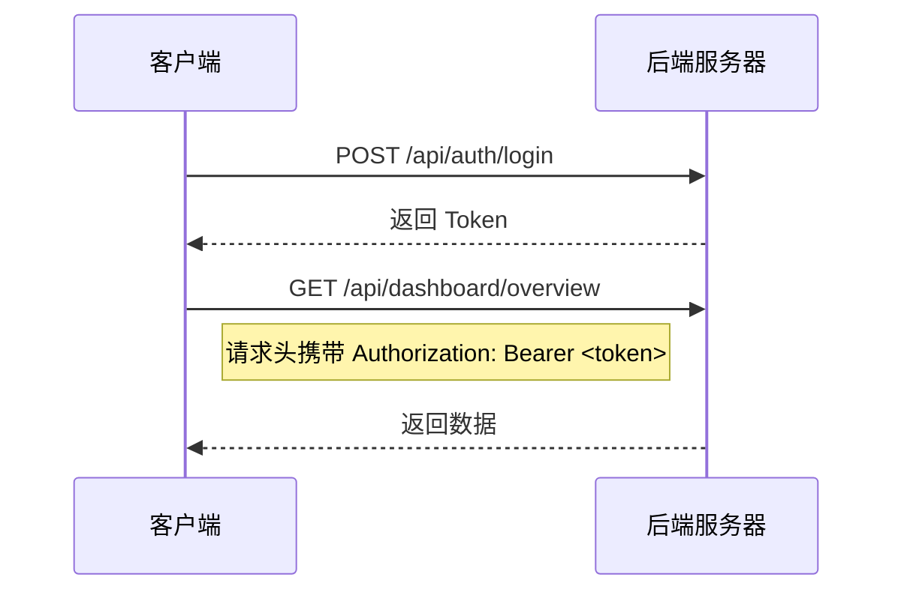

# 云南自然灾害应急协同决策平台 - 前后端接口文档

## 1. 文档信息

| 属性 | 值 |
|------|------|
| 版本 | 2.0.0 |
| 基础URL | `http://localhost:8080` |
| 默认内容类型 | `application/json` |
| 认证方式 | JWT Bearer Token |
| AI服务URL | `http://localhost:8002` |

---

## 2. 认证方式说明

### 2.1 JWT Token

- **获取方式**：登录成功后由 `/api/auth/login` 接口返回
- **存储方式**：前端存储在 Pinia 状态管理中（内存）
- **传递方式**：通过 `Authorization: Bearer <token>` 请求头传递
- **有效期**：24小时（86400000毫秒）

### 2.2 认证流程



---

## 3. 统一响应格式

### 3.1 成功响应

```json
{
    "code": 0,
    "message": "success",
    "data": {},
    "timestamp": "2026-07-25T16:30:00"
}
```

### 3.2 错误响应

```json
{
    "code": -1,
    "message": "错误描述",
    "data": null,
    "timestamp": "2026-07-25T16:30:00"
}
```

### 3.3 状态码说明

| 状态码 | 含义 | 说明 |
|--------|------|------|
| **0** | 成功 | 请求处理成功 |
| **-1** | 业务失败 | 业务逻辑错误 |
| **400** | 请求参数错误 | 参数格式或校验失败 |
| **401** | 未授权 | Token无效或未登录 |
| **403** | 禁止访问 | 无权限访问该资源 |
| **500** | 服务器内部错误 | 服务端异常 |

---

## 4. 认证模块接口

### 4.1 用户登录

**请求方法**：POST  
**URL**：`/api/auth/login`  
**需要认证**：否

**请求体**：

| 字段 | 类型 | 必填 | 说明 |
|------|------|------|------|
| username | String | 是 | 用户名 |
| password | String | 是 | 密码 |

**请求示例**：

```json
{
    "username": "admin",
    "password": "123456"
}
```

**响应示例**：

```json
{
    "code": 0,
    "message": "登录成功",
    "data": {
        "token": "eyJhbGciOiJIUzM4NCJ9...",
        "tokenType": "Bearer",
        "expiresIn": 86400000,
        "userId": 1,
        "username": "admin",
        "realName": "管理员",
        "roleName": "ADMIN"
    },
    "timestamp": "2026-07-25T16:30:00"
}
```

**错误响应**：

```json
{
    "code": 401,
    "message": "用户名或密码错误",
    "data": null,
    "timestamp": "2026-07-25T16:30:00"
}
```

### 4.2 用户注册

**请求方法**：POST  
**URL**：`/api/auth/register`  
**需要认证**：否

**请求体**：

| 字段 | 类型 | 必填 | 说明 |
|------|------|------|------|
| username | String | 是 | 用户名，长度3-50 |
| password | String | 是 | 密码，长度6-100 |
| realName | String | 否 | 真实姓名 |

**请求示例**：

```json
{
    "username": "testuser",
    "password": "123456",
    "realName": "测试用户"
}
```

**响应示例**：

```json
{
    "code": 0,
    "message": "注册成功",
    "data": {
        "id": 2,
        "username": "testuser",
        "realName": "测试用户",
        "roleName": "VIEWER",
        "createdAt": "2026-07-25T16:30:00"
    },
    "timestamp": "2026-07-25T16:30:00"
}
```

**错误响应**：

```json
{
    "code": 400,
    "message": "用户名已存在",
    "data": null,
    "timestamp": "2026-07-25T16:30:00"
}
```

### 4.3 角色申请

**请求方法**：POST  
**URL**：`/api/role-application/apply`  
**需要认证**：是  
**允许角色**：VIEWER

**请求体**：

| 字段 | 类型 | 必填 | 说明 |
|------|------|------|------|
| targetRole | String | 是 | 目标角色（OPERATOR/RESOURCE_MANAGER） |
| reason | String | 是 | 申请原因 |

**响应示例**：

```json
{
    "code": 0,
    "message": "申请成功，等待审核",
    "data": {
        "applicationId": "app-xxx",
        "status": "pending"
    },
    "timestamp": "2026-07-25T16:30:00"
}
```

### 4.4 审核角色申请

**请求方法**：POST  
**URL**：`/api/role-application/audit`  
**需要认证**：是  
**允许角色**：ADMIN

**请求体**：

| 字段 | 类型 | 必填 | 说明 |
|------|------|------|------|
| applicationId | String | 是 | 申请ID |
| action | String | 是 | 操作（APPROVE/REJECT） |
| comment | String | 否 | 审核备注 |

**响应示例**：

```json
{
    "code": 0,
    "message": "审核成功",
    "data": {
        "applicationId": "app-xxx",
        "status": "approved"
    },
    "timestamp": "2026-07-25T16:30:00"
}
```

---

## 5. 灾情管理模块接口

### 5.1 灾情上报

**请求方法**：POST  
**URL**：`/api/incident/report`  
**需要认证**：是  
**允许角色**：VIEWER/OPERATOR/RESOURCE_MANAGER/ADMIN

**请求头**：

| 名称 | 值 | 必填 |
|------|-----|------|
| Content-Type | multipart/form-data | 是 |

**请求参数**（FormData格式）：

| 字段 | 类型 | 必填 | 说明 |
|------|------|------|------|
| incidentName | String | 是 | 灾情名称，长度1-200 |
| disasterType | String | 是 | 灾害类型（earthquake/flood/landslide/mudslide/fire/drought/other） |
| incidentLevel | String | 否 | 灾情级别（I/II/III/IV） |
| location | String | 否 | 发生地点（文本地址，系统自动通过高德API地理编码获取经纬度） |
| description | String | 否 | 灾情描述，长度0-2000 |
| latitude | Double | 否 | 纬度（可选，如提供则优先使用，DECIMAL(10,7)精度，后端以BigDecimal存储） |
| longitude | Double | 否 | 经度（可选，如提供则优先使用，DECIMAL(10,7)精度，后端以BigDecimal存储） |
| deathCount | Integer | 否 | 死亡人数 |
| propertyLoss | Double | 否 | 财产损失（万元） |
| images | File[] | 否 | 图片文件数组，最多5张 |

**地理编码说明**：当未提供latitude/longitude但提供了location地址时，系统自动调用高德地图API进行地理编码，获取经纬度信息。地理编码流程：本地城市坐标缓存 → 高德API调用 → 降级模糊匹配。

**响应示例**：

```json
{
    "code": 0,
    "message": "success",
    "data": {
        "incidentId": "baadad56-1f14-4ad5-8c3f-1fc3f0e35f32",
        "imageUrls": [
            "/api/image/20260725/xxx_abc123.jpg",
            "/api/image/20260725/xxx_def456.jpg"
        ]
    },
    "timestamp": "2026-07-25T16:30:00"
}
```

### 5.2 获取灾情列表

**请求方法**：GET  
**URL**：`/api/incident/list`  
**需要认证**：是  
**允许角色**：VIEWER/OPERATOR/RESOURCE_MANAGER/ADMIN

**请求参数**（Query）：

| 字段 | 类型 | 必填 | 说明 |
|------|------|------|------|
| page | Integer | 否 | 页码，默认1 |
| size | Integer | 否 | 每页条数，默认10 |
| disasterType | String | 否 | 灾害类型筛选 |
| incidentLevel | String | 否 | 灾情级别筛选 |
| status | String | 否 | 状态筛选（pending/confirmed/processing/completed） |
| keyword | String | 否 | 关键词搜索 |

**响应示例**：

```json
{
    "code": 0,
    "message": "success",
    "data": {
        "total": 50,
        "list": [
            {
                "id": 1,
                "incidentId": "baadad56-1f14-4ad5-8c3f-1fc3f0e35f32",
                "incidentName": "昆明暴雨灾害",
                "disasterType": "flood",
                "incidentLevel": "III",
                "status": "pending",
                "location": "昆明市五华区",
                "latitude": 25.0406000,
                "longitude": 102.7123000,
                "reportTime": "2026-07-25T10:40:44",
                "createdAt": "2026-07-25T10:40:44"
            }
        ]
    },
    "timestamp": "2026-07-25T16:30:00"
}
```

### 5.3 获取灾情详情

**请求方法**：GET  
**URL**：`/api/incident/detail`  
**需要认证**：是  
**允许角色**：VIEWER/OPERATOR/RESOURCE_MANAGER/ADMIN

**请求参数**（Query）：

| 字段 | 类型 | 必填 | 说明 |
|------|------|------|------|
| incidentId | String | 是 | 灾情唯一标识 |

**响应示例**：

```json
{
    "code": 0,
    "message": "success",
    "data": {
        "id": 1,
        "incidentId": "baadad56-1f14-4ad5-8c3f-1fc3f0e35f32",
        "incidentName": "昆明暴雨灾害",
        "disasterType": "flood",
        "incidentLevel": "III",
        "location": "昆明市五华区",
        "latitude": 25.0406000,
        "longitude": 102.7123000,
        "description": "昆明市五华区遭遇强降雨，部分路段积水严重。",
        "status": "pending",
        "imageUrls": "[\"/api/image/20260725/xxx.jpg\"]",
        "reporterId": 1,
        "reportTime": "2026-07-25T10:40:44",
        "createdAt": "2026-07-25T10:40:44",
        "updatedAt": "2026-07-25T10:40:44"
    },
    "timestamp": "2026-07-25T16:30:00"
}
```

### 5.4 灾情状态流转

**请求方法**：POST  
**URL**：`/api/incident/{id}/status`  
**需要认证**：是  
**允许角色**：OPERATOR/RESOURCE_MANAGER/ADMIN

**请求体**：

| 字段 | 类型 | 必填 | 说明 |
|------|------|------|------|
| status | String | 是 | 目标状态（pending/confirmed/processing/completed） |

**响应示例**：

```json
{
    "code": 0,
    "message": "success",
    "data": {
        "incidentId": "baadad56-1f14-4ad5-8c3f-1fc3f0e35f32",
        "status": "confirmed"
    },
    "timestamp": "2026-07-25T16:30:00"
}
```

### 5.5 历史数据坐标补全

**请求方法**：POST  
**URL**：`/api/incident/backfill-coordinates`  
**需要认证**：是  
**允许角色**：ADMIN

**请求体**：无（无参数）

**说明**：遍历系统中所有缺少经纬度的灾情记录，根据location地址自动调用地理编码服务（本地缓存 + 高德API + 降级匹配）补全latitude和longitude字段。

**响应示例**：

```json
{
    "code": 0,
    "message": "success",
    "data": {
        "total": 50,
        "updated": 45,
        "failed": 5
    },
    "timestamp": "2026-07-25T16:30:00"
}
```

**响应字段说明**：
| 字段 | 类型 | 说明 |
|------|------|------|
| total | Integer | 需要补全的记录总数（有location且无经纬度） |
| updated | Integer | 成功补全的记录数 |
| failed | Integer | 补全失败的记录数 |

**失败原因**：location地址无法匹配云南省城市坐标，且高德API调用失败。

---

## 6. 方案管理模块接口

### 6.1 方案生成

**请求方法**：POST  
**URL**：`/api/plan/generate`  
**需要认证**：是  
**允许角色**：OPERATOR/ADMIN

**请求体**：

| 字段 | 类型 | 必填 | 说明 |
|------|------|------|------|
| incidentId | String | 是 | 灾情唯一标识 |

**响应示例**：

```json
{
    "code": 0,
    "message": "success",
    "data": {
        "planId": "dccb4264-b725-46d0-a959-964bf1fef6c1"
    },
    "timestamp": "2026-07-25T16:30:00"
}
```

**响应时间**：约25-120秒（含AI推理）

### 6.2 获取方案详情

**请求方法**：GET  
**URL**：`/api/plan/detail`  
**需要认证**：是  
**允许角色**：VIEWER/OPERATOR/RESOURCE_MANAGER/ADMIN

**请求参数**（Query）：

| 字段 | 类型 | 必填 | 说明 |
|------|------|------|------|
| planId | String | 是 | 方案唯一标识 |

**响应示例**：

```json
{
    "code": 0,
    "message": "success",
    "data": {
        "id": 1,
        "planId": "dccb4264-b725-46d0-a959-964bf1fef6c1",
        "incidentId": "baadad56-1f14-4ad5-8c3f-1fc3f0e35f32",
        "planTitle": "应急预案 - 昆明暴雨灾害",
        "planContent": "【应急预案】\n\n一、灾情概况\n...",
        "generateTime": "2026-07-25T10:40:57",
        "status": "draft",
        "createdAt": "2026-07-25T10:40:57",
        "updatedAt": "2026-07-25T10:40:57"
    },
    "timestamp": "2026-07-25T16:30:00"
}
```

### 6.3 获取方案列表

**请求方法**：GET  
**URL**：`/api/plan/list`  
**需要认证**：是  
**允许角色**：VIEWER/OPERATOR/RESOURCE_MANAGER/ADMIN

**请求参数**（Query）：

| 字段 | 类型 | 必填 | 说明 |
|------|------|------|------|
| incidentId | String | 是 | 灾情唯一标识 |

**响应示例**：

```json
{
    "code": 0,
    "message": "success",
    "data": [
        {
            "id": 1,
            "planId": "dccb4264-b725-46d0-a959-964bf1fef6c1",
            "incidentId": "baadad56-1f14-4ad5-8c3f-1fc3f0e35f32",
            "planTitle": "应急预案 - 昆明暴雨灾害",
            "status": "draft",
            "generateTime": "2026-07-25T10:40:57",
            "createdAt": "2026-07-25T10:40:57"
        }
    ],
    "timestamp": "2026-07-25T16:30:00"
}
```

### 6.4 方案流式输出

**请求方法**：GET  
**URL**：`/api/plan/stream`  
**需要认证**：是  
**允许角色**：OPERATOR/ADMIN

**请求头**：

| 名称 | 值 | 必填 |
|------|-----|------|
| Accept | text/event-stream | 是 |
| Cache-Control | no-cache | 是 |

**请求参数**（Query）：

| 字段 | 类型 | 必填 | 说明 |
|------|------|------|------|
| incidentId | String | 是 | 灾情唯一标识 |

**响应格式**（SSE）：

```
event: connect
data: connected

event: message
data: 【应急预案】

event: message
data: 一、灾情概况

event: message
data: 灾害类型：暴雨

...（持续推送）
```

### 6.5 审核方案

**请求方法**：POST  
**URL**：`/api/plan/review`  
**需要认证**：是  
**允许角色**：OPERATOR/ADMIN

**请求体**：

| 字段 | 类型 | 必填 | 说明 |
|------|------|------|------|
| planId | String | 是 | 方案唯一标识 |
| action | String | 是 | 审核操作（APPROVE/REJECT/MODIFY） |
| modifyContent | String | 否 | 修改后的方案内容（仅action=MODIFY时有效） |
| remark | String | 否 | 审核备注 |

**响应示例**：

```json
{
    "code": 0,
    "message": "success",
    "data": {
        "id": 5,
        "planId": "dccb4264-b725-46d0-a959-964bf1fef6c1",
        "status": "approved",
        "updatedAt": "2026-07-25T16:00:00"
    },
    "timestamp": "2026-07-25T16:30:00"
}
```

---

## 7. 资源管理模块接口

### 7.1 获取资源列表

**请求方法**：GET  
**URL**：`/api/resource/list`  
**需要认证**：是  
**允许角色**：RESOURCE_MANAGER/ADMIN

**请求参数**（Query）：

| 字段 | 类型 | 必填 | 说明 |
|------|------|------|------|
| resourceType | String | 否 | 资源类型筛选（物资/设备/人员/车辆） |

**响应示例**：

```json
{
    "code": 0,
    "message": "success",
    "data": [
        {
            "id": 1,
            "resourceId": "RES001",
            "resourceName": "帐篷",
            "resourceType": "物资",
            "totalStock": 1000,
            "availableStock": 850,
            "lockedStock": 150,
            "location": "昆明市储备库",
            "unit": "顶",
            "status": "available"
        }
    ],
    "timestamp": "2026-07-25T16:30:00"
}
```

### 7.2 查询可用资源

**请求方法**：GET  
**URL**：`/api/resource/available`  
**需要认证**：是  
**允许角色**：RESOURCE_MANAGER/ADMIN

**响应示例**：

```json
{
    "code": 0,
    "message": "success",
    "data": [
        {
            "id": 1,
            "resourceId": "RES001",
            "resourceName": "帐篷",
            "availableStock": 850,
            "location": "昆明市储备库"
        }
    ],
    "timestamp": "2026-07-25T16:30:00"
}
```

### 7.3 锁定资源

**请求方法**：POST  
**URL**：`/api/resource/lock`  
**需要认证**：是  
**允许角色**：RESOURCE_MANAGER/ADMIN

**请求体**：

| 字段 | 类型 | 必填 | 说明 |
|------|------|------|------|
| resourceId | String | 是 | 资源唯一标识 |
| quantity | Integer | 是 | 锁定数量 |
| incidentId | String | 否 | 关联灾情ID |
| planId | String | 否 | 关联方案ID |
| remark | String | 否 | 备注说明 |

**响应示例**：

```json
{
    "code": 0,
    "message": "success",
    "data": {
        "success": true,
        "message": "资源锁定成功",
        "resource": {
            "id": 1,
            "resourceId": "RES001",
            "availableStock": 750,
            "lockedStock": 250
        },
        "recordId": "dispatch-record-uuid"
    },
    "timestamp": "2026-07-25T16:30:00"
}
```

**错误响应**：

```json
{
    "code": -1,
    "message": "可用库存不足，当前可用: 850",
    "data": null,
    "timestamp": "2026-07-25T16:30:00"
}
```

### 7.4 释放资源

**请求方法**：POST  
**URL**：`/api/resource/release`  
**需要认证**：是  
**允许角色**：RESOURCE_MANAGER/ADMIN

**请求体**：

| 字段 | 类型 | 必填 | 说明 |
|------|------|------|------|
| resourceId | String | 是 | 资源唯一标识 |
| quantity | Integer | 是 | 释放数量 |
| remark | String | 否 | 备注说明 |

**响应示例**：

```json
{
    "code": 0,
    "message": "success",
    "data": {
        "success": true,
        "message": "资源释放成功",
        "resource": {
            "id": 1,
            "resourceId": "RES001",
            "availableStock": 800,
            "lockedStock": 200
        },
        "recordId": "dispatch-record-uuid"
    },
    "timestamp": "2026-07-25T16:30:00"
}
```

### 7.5 查询调度记录

**请求方法**：GET  
**URL**：`/api/resource/dispatch-records`  
**需要认证**：是  
**允许角色**：RESOURCE_MANAGER/ADMIN

**请求参数**（Query）：

| 字段 | 类型 | 必填 | 说明 |
|------|------|------|------|
| resourceId | String | 否 | 按资源ID筛选 |
| incidentId | String | 否 | 按灾情ID筛选 |

**响应示例**：

```json
{
    "code": 0,
    "message": "success",
    "data": [
        {
            "id": 1,
            "recordId": "dispatch-record-uuid",
            "resourceId": "RES001",
            "resourceName": "帐篷",
            "incidentId": "INC20240120001",
            "dispatchType": "lock",
            "quantity": 100,
            "status": "completed",
            "createdAt": "2026-07-25T15:00:00"
        }
    ],
    "timestamp": "2026-07-25T16:30:00"
}
```

---

## 8. Dashboard模块接口

### 8.1 概览

**请求方法**：GET  
**URL**：`/api/dashboard/overview`  
**需要认证**：是  
**允许角色**：VIEWER/OPERATOR/RESOURCE_MANAGER/ADMIN

**响应示例**：

```json
{
    "code": 0,
    "message": "success",
    "data": {
        "todayCount": 5,
        "activeCount": 12,
        "pendingCount": 3,
        "completedCount": 45
    },
    "timestamp": "2026-07-25T16:30:00"
}
```

### 8.2 趋势分析

**请求方法**：GET  
**URL**：`/api/dashboard/trend`  
**需要认证**：是  
**允许角色**：VIEWER/OPERATOR/RESOURCE_MANAGER/ADMIN

**响应示例**：

```json
{
    "code": 0,
    "message": "success",
    "data": {
        "dates": ["2026-07-20", "2026-07-21", "2026-07-22", "2026-07-23", "2026-07-24", "2026-07-25"],
        "counts": [10, 8, 12, 15, 9, 5]
    },
    "timestamp": "2026-07-25T16:30:00"
}
```

### 8.3 分布统计

**请求方法**：GET  
**URL**：`/api/dashboard/distribution`  
**需要认证**：是  
**允许角色**：VIEWER/OPERATOR/RESOURCE_MANAGER/ADMIN

**响应示例**：

```json
{
    "code": 0,
    "message": "success",
    "data": {
        "types": ["地震", "洪涝", "泥石流", "火灾"],
        "counts": [15, 20, 8, 5]
    },
    "timestamp": "2026-07-25T16:30:00"
}
```

### 8.4 数据大屏

**请求方法**：GET  
**URL**：`/api/dashboard/screen`  
**需要认证**：是  
**允许角色**：VIEWER/OPERATOR/RESOURCE_MANAGER/ADMIN

**说明**：返回大屏展示所需的全部数据，包括统计概览、灾情列表（含经纬度用于地图展示）、资源列表等。后端使用JPA `BigDecimal` 类型存储经纬度（对应MySQL `DECIMAL(10,7)`），确保坐标精度不丢失。前端使用Leaflet将灾情点位渲染到地图上，支持按灾害类型、状态筛选和聚合展示。mapIncidents 字段返回所有具有有效坐标的灾情（不分状态），确保地图能完整展示。

**响应示例**：

```json
{
    "code": 0,
    "message": "success",
    "data": {
        "statistics": {
            "todayCount": 3,
            "activeCount": 12,
            "completedCount": 45
        },
        "incidents": [
            {
                "incidentId": "baadad56-1f14-4ad5-8c3f-1fc3f0e35f32",
                "incidentName": "昆明暴雨灾害",
                "disasterType": "flood",
                "incidentLevel": "III",
                "status": "pending",
                "location": "昆明市五华区",
                "latitude": 25.0406,
                "longitude": 102.7123
            }
        ],
        "resources": [...],
        "mapIncidents": [
            {
                "incidentId": "aefea948-3695-40a5-b4ab-a43a932b7820",
                "incidentName": "昆明地震灾害",
                "disasterType": "earthquake",
                "incidentLevel": "II",
                "status": "processing",
                "latitude": 25.0406,
                "longitude": 102.7123,
                "occurTime": "2026-07-27T08:30:00",
                "location": "昆明市五华区",
                "disposalPlanStatus": "accepted",
                "resourceDispatchStatus": "executing",
                "deathCount": 5,
                "propertyLoss": 120.5
            }
        ]
    },
    "timestamp": "2026-07-27T16:30:00"
}
```

**mapIncidents 字段说明**：返回所有具有有效经纬度的灾情记录（共55条），字段包括：

| 字段 | 类型 | 说明 |
|------|------|------|
| incidentId | String | 灾情唯一标识 |
| incidentName | String | 灾情名称 |
| disasterType | String | 灾害类型 |
| incidentLevel | String | 灾情级别 |
| status | String | 状态（pending/confirmed/processing/completed） |
| latitude | Number | 纬度（BigDecimal→JSON浮点数） |
| longitude | Number | 经度（BigDecimal→JSON浮点数） |
| occurTime | String | 发生时间 |
| location | String | 发生地点 |
| disposalPlanStatus | String | 处置方案状态 |
| resourceDispatchStatus | String | 资源调度状态 |
| deathCount | Number | 死亡人数 |
| propertyLoss | Number | 财产损失（万元） |

---

## 9. 系统管理模块接口

### 9.1 用户管理

#### 9.1.1 获取用户列表

**请求方法**：GET  
**URL**：`/api/user/list`  
**需要认证**：是  
**允许角色**：ADMIN

**响应示例**：

```json
{
    "code": 0,
    "message": "success",
    "data": {
        "total": 20,
        "list": [
            {
                "id": 1,
                "username": "admin",
                "realName": "管理员",
                "roleName": "ADMIN",
                "status": "active"
            }
        ]
    },
    "timestamp": "2026-07-25T16:30:00"
}
```

#### 9.1.2 创建用户

**请求方法**：POST  
**URL**：`/api/user/create`  
**需要认证**：是  
**允许角色**：ADMIN

**请求体**：

| 字段 | 类型 | 必填 | 说明 |
|------|------|------|------|
| username | String | 是 | 用户名 |
| password | String | 是 | 密码 |
| realName | String | 否 | 真实姓名 |
| roleName | String | 是 | 角色（ADMIN/OPERATOR/RESOURCE_MANAGER/VIEWER） |

**响应示例**：

```json
{
    "code": 0,
    "message": "success",
    "data": {
        "id": 21,
        "username": "newuser",
        "roleName": "VIEWER"
    },
    "timestamp": "2026-07-25T16:30:00"
}
```

#### 9.1.3 更新用户

**请求方法**：PUT  
**URL**：`/api/user/update`  
**需要认证**：是  
**允许角色**：ADMIN

**请求体**：

| 字段 | 类型 | 必填 | 说明 |
|------|------|------|------|
| id | Long | 是 | 用户ID |
| username | String | 否 | 用户名 |
| realName | String | 否 | 真实姓名 |
| roleName | String | 否 | 角色 |
| status | String | 否 | 状态 |

#### 9.1.4 删除用户

**请求方法**：DELETE  
**URL**：`/api/user/delete`  
**需要认证**：是  
**允许角色**：ADMIN

**请求参数**（Query）：

| 字段 | 类型 | 必填 | 说明 |
|------|------|------|------|
| id | Long | 是 | 用户ID |

### 9.2 知识库管理

#### 9.2.1 获取知识库列表

**请求方法**：GET  
**URL**：`/api/knowledge/list`  
**需要认证**：是  
**允许角色**：ADMIN

**响应示例**：

```json
{
    "code": 0,
    "message": "success",
    "data": [
        {
            "id": 1,
            "documentName": "云南省地震应急预案",
            "documentType": "地震应急预案",
            "chapter": "第一章",
            "content": "...",
            "createdAt": "2026-07-22T10:00:00"
        }
    ],
    "timestamp": "2026-07-25T16:30:00"
}
```

#### 9.2.2 上传知识库文档

**请求方法**：POST  
**URL**：`/api/knowledge/upload`  
**需要认证**：是  
**允许角色**：ADMIN

**请求头**：

| 名称 | 值 | 必填 |
|------|-----|------|
| Content-Type | multipart/form-data | 是 |

**请求参数**（FormData格式）：

| 字段 | 类型 | 必填 | 说明 |
|------|------|------|------|
| file | File | 是 | PDF文件 |

**响应示例**：

```json
{
    "code": 0,
    "message": "success",
    "data": {
        "documentName": "云南省地震应急预案",
        "chunkCount": 201
    },
    "timestamp": "2026-07-25T16:30:00"
}
```

#### 9.2.3 删除知识库文档

**请求方法**：DELETE  
**URL**：`/api/knowledge/delete`  
**需要认证**：是  
**允许角色**：ADMIN

**请求参数**（Query）：

| 字段 | 类型 | 必填 | 说明 |
|------|------|------|------|
| documentId | String | 是 | 文档ID |

### 9.3 审计日志

#### 9.3.1 获取审计日志列表

**请求方法**：GET  
**URL**：`/api/audit/logs`  
**需要认证**：是  
**允许角色**：ADMIN

**请求参数**（Query）：

| 字段 | 类型 | 必填 | 说明 |
|------|------|------|------|
| page | Integer | 否 | 页码 |
| size | Integer | 否 | 每页条数 |
| userId | Long | 否 | 按用户ID筛选 |
| module | String | 否 | 按模块筛选 |
| startTime | String | 否 | 开始时间 |
| endTime | String | 否 | 结束时间 |

**响应示例**：

```json
{
    "code": 0,
    "message": "success",
    "data": {
        "total": 1000,
        "list": [
            {
                "id": 1,
                "userId": 1,
                "username": "admin",
                "module": "resource",
                "action": "lock",
                "actionType": "UPDATE",
                "detail": "锁定资源 RES001，数量100",
                "ipAddress": "127.0.0.1",
                "duration": 150,
                "createdAt": "2026-07-25T15:00:00"
            }
        ]
    },
    "timestamp": "2026-07-25T16:30:00"
}
```

### 9.4 Agent审计

#### 9.4.1 获取Agent执行记录

**请求方法**：GET  
**URL**：`/api/agent/runs`  
**需要认证**：是  
**允许角色**：ADMIN

**响应示例**：

```json
{
    "code": 0,
    "message": "success",
    "data": [
        {
            "id": 1,
            "runId": "run-xxx",
            "agentType": "plan_generator",
            "status": "completed",
            "input": "云南省昆明市五华区发生4.5级地震...",
            "output": "方案内容...",
            "duration": 125000,
            "createdAt": "2026-07-25T10:00:00"
        }
    ],
    "timestamp": "2026-07-25T16:30:00"
}
```

---

## 10. AI服务接口

### 10.1 健康检查

**请求方法**：GET  
**URL**：`http://localhost:8002/health`  
**需要认证**：否

**响应示例**：

```json
{
    "status": "ok",
    "service": "ai-service",
    "workflow_ready": true
}
```

### 10.2 方案生成（同步）

**请求方法**：POST  
**URL**：`http://localhost:8002/api/v1/generate-plan`  
**需要认证**：否

**请求体**：

| 字段 | 类型 | 必填 | 说明 |
|------|------|------|------|
| description | String | 是 | 灾情描述文本，建议长度20-500字 |

**请求示例**：

```json
{
    "description": "云南省昆明市五华区发生4.5级地震，震源深度10公里，部分房屋受损，约500人受影响。"
}
```

**响应示例**：

```json
{
    "plan": "# 地震应急处置方案\n\n## 一、事件概况\n...\n\n## 参考资料\n1. 云南省地震应急预案（章节4，相似度0.6275）\n2. 昆明市自然灾害应急预案（章节8，相似度0.6124）\n3. 五华区应急处置手册（章节6，相似度0.6029）",
    "citations": [
        {
            "source": "云南省地震应急预案",
            "chapter": "4",
            "similarity": 0.6275,
            "content": "各级政府及其有关部门应对本行政区域内地震灾害风险进行评估..."
        }
    ]
}
```

**响应时间**：约25-125秒（含RAG检索和资源调度）

### 10.3 方案生成（流式）

**请求方法**：POST  
**URL**：`http://localhost:8002/api/v1/generate-plan/stream`  
**需要认证**：否

**请求头**：

| 名称 | 值 | 必填 |
|------|-----|------|
| Content-Type | application/json | 是 |
| Accept | text/event-stream | 建议 |

**请求体**：同同步接口

**响应格式**（SSE）：

```
data: {"chunk": "### 地震灾害应急处置方案", "index": 0, "total": 18, "done": false}
data: {"chunk": "#### 1. 事件概况", "index": 1, "total": 18, "done": false}
...
data: {"chunk": "---\n*注：本方案为自动生成，请根据实际情况调整。*", "index": 17, "total": 18, "done": true}
```

---

## 11. 枚举值对照表

### 11.1 灾害类型

| 值 | 中文标签 |
|----|----------|
| earthquake | 地震 |
| flood | 洪涝 |
| landslide | 山体滑坡 |
| debris_flow | 泥石流 |
| fire | 森林火灾 |
| drought | 干旱 |
| typhoon | 台风 |
| other | 其他 |

### 11.2 灾情级别

| 值 | 中文标签 |
|----|----------|
| I | Ⅰ级（特别重大） |
| II | Ⅱ级（重大） |
| III | Ⅲ级（较大） |
| IV | Ⅳ级（一般） |

### 11.3 灾情状态

| 值 | 中文标签 |
|----|----------|
| pending | 待确认 |
| confirmed | 已确认 |
| processing | 处置中 |
| completed | 已结束 |

### 11.4 资源类型

| 值 | 中文标签 |
|----|----------|
| 物资 | 应急物资 |
| 设备 | 救援设备 |
| 人员 | 救援人员 |
| 车辆 | 运输车辆 |

### 11.5 方案状态

| 值 | 中文标签 |
|----|----------|
| draft | 草稿 |
| approved | 已审批 |
| rejected | 已驳回 |
| modified | 已修改 |

### 11.6 用户角色

| 值 | 中文标签 |
|----|----------|
| VIEWER | 普通信息员 |
| OPERATOR | 应急指挥人员 |
| RESOURCE_MANAGER | 资源管理员 |
| ADMIN | 系统管理员 |

---

## 12. 文档版本记录

| 版本 | 日期 | 修改人 | 修改内容 |
|------|------|--------|----------|
| V1.0 | 2026-07-25 | 系统生成 | 初始版本 |
| V2.0 | 2026-07-26 | 系统生成 | 灾情上报新增经纬度字段和地理编码说明，更新灾情状态枚举值，新增历史数据坐标补全接口(POST /api/incident/backfill-coordinates)，数据大屏接口增加地图数据说明 |
| V3.0 | 2026-07-27 | 系统生成 | 完善大屏接口响应示例（新增mapIncidents字段详细说明，含所有状态灾情坐标），补充BigDecimal坐标映射说明，更新坐标精度描述 |
