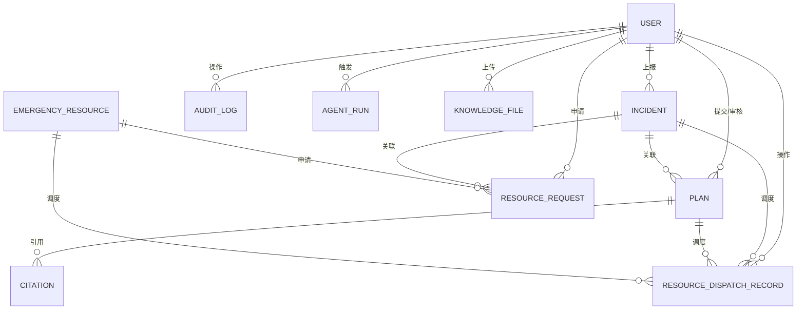
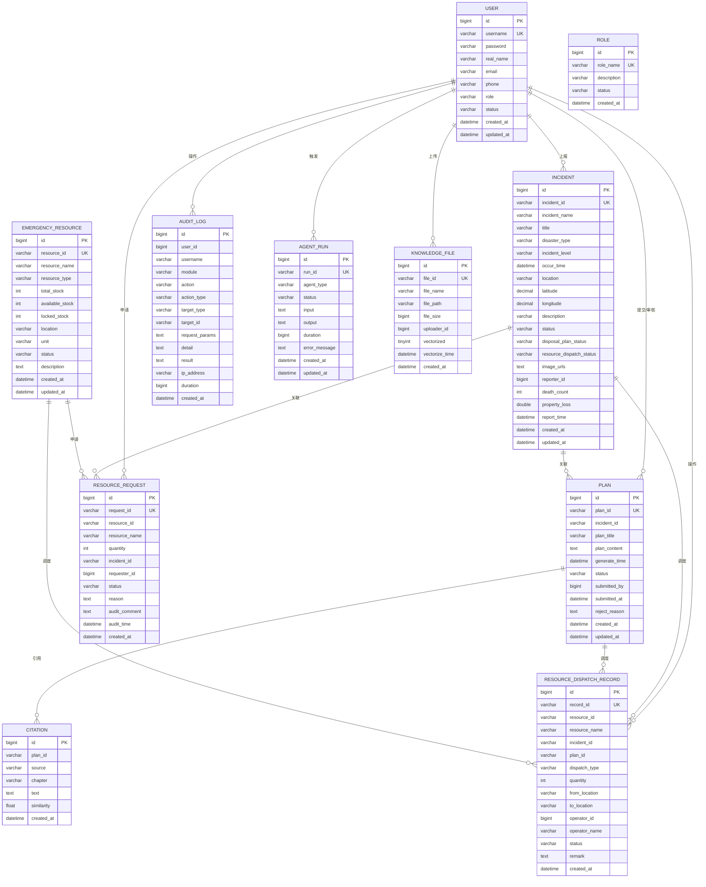
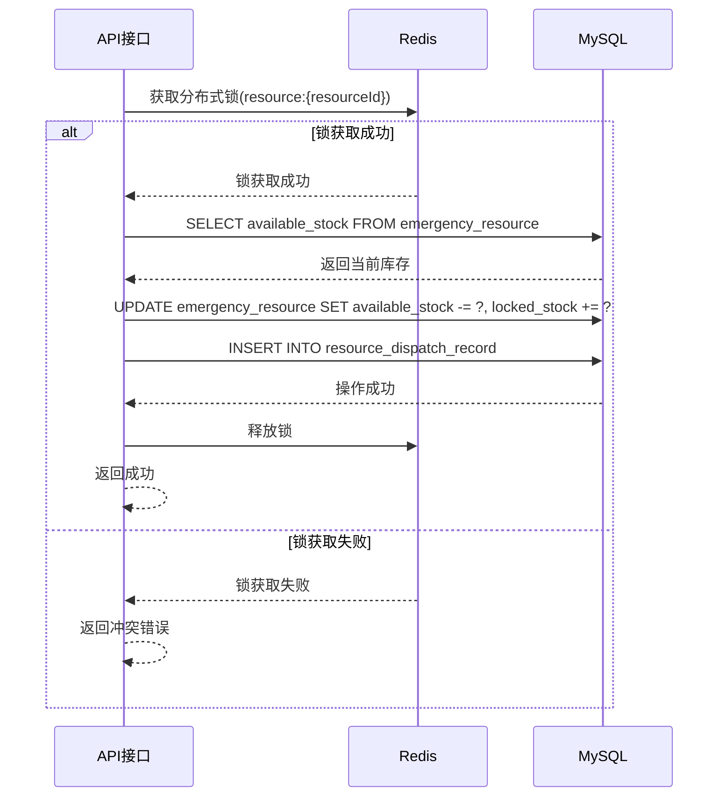
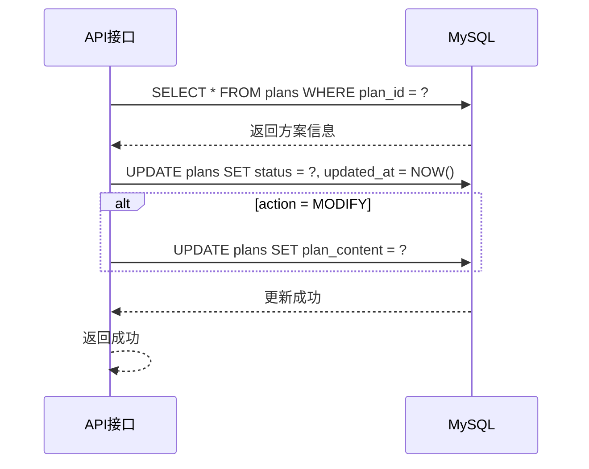
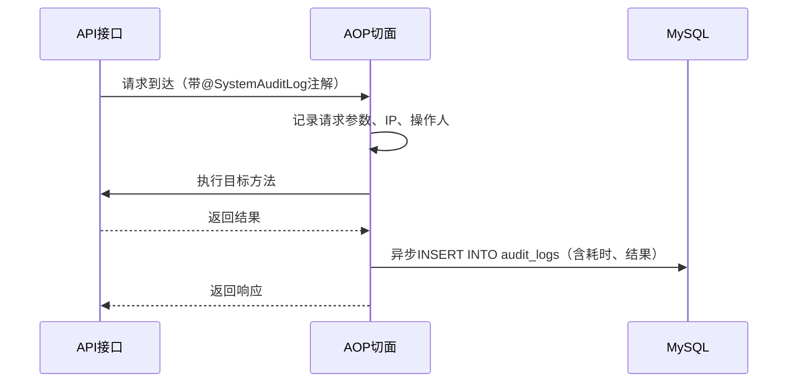
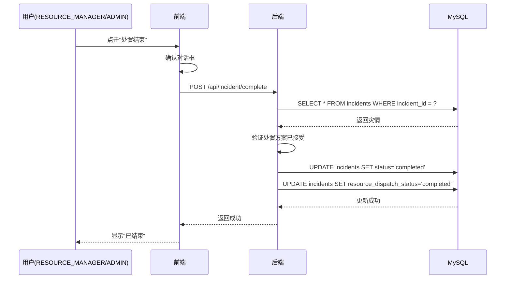

# 云南自然灾害应急协同决策平台 - 数据库设计文档

## 1. 数据库概览

### 1.1 数据库列表

| 数据库名 | 类型 | 用途 | 端口 |
|----------|------|------|------|
| emergency_db | MySQL | 主业务数据库，存储灾情、预案、资源、审计日志等数据 | 3306 |
| emergency_vector | PostgreSQL | 向量数据库，存储应急预案向量数据（RAG检索用） | 5432 |

### 1.2 数据库连接信息

**MySQL（emergency_db）**：
| 配置项 | 值 |
|--------|-----|
| 主机 | localhost |
| 端口 | 3306 |
| 用户名 | root |
| 密码 | （空） |
| 数据库名 | emergency_db |

**PostgreSQL（emergency_vector）**：
| 配置项 | 值 |
|--------|-----|
| 主机 | localhost |
| 端口 | 5432 |
| 用户名 | postgres |
| 密码 | ZAQ12wsx581! |
| 数据库名 | emergency_vector |

---

## 2. MySQL 数据表设计

### 2.1 用户表（users）

**表说明**：存储系统用户信息。

| 字段名 | 类型 | 约束 | 默认值 | 注释 |
|--------|------|------|--------|------|
| id | BIGINT | PRIMARY KEY, AUTO_INCREMENT | - | 自增主键 |
| username | VARCHAR(50) | UNIQUE, NOT NULL | - | 用户名 |
| password | VARCHAR(255) | NOT NULL | - | 密码（BCrypt加密） |
| real_name | VARCHAR(100) | - | - | 真实姓名 |
| email | VARCHAR(100) | UNIQUE | - | 邮箱 |
| phone | VARCHAR(20) | - | - | 手机号 |
| role | VARCHAR(50) | NOT NULL | 'VIEWER' | 角色（ADMIN/OPERATOR/RESOURCE_MANAGER/VIEWER） |
| status | VARCHAR(20) | NOT NULL | 'active' | 状态（active/inactive/locked） |
| created_at | DATETIME | NOT NULL | CURRENT_TIMESTAMP | 创建时间 |
| updated_at | DATETIME | NOT NULL | CURRENT_TIMESTAMP ON UPDATE CURRENT_TIMESTAMP | 更新时间 |

**索引**：
| 索引名 | 字段 | 类型 |
|--------|------|------|
| PRIMARY | id | PRIMARY |
| uk_username | username | UNIQUE |
| uk_email | email | UNIQUE |
| idx_role | role | NORMAL |
| idx_status | status | NORMAL |

---

### 2.2 角色表（roles）

**表说明**：存储角色定义信息。

| 字段名 | 类型 | 约束 | 默认值 | 注释 |
|--------|------|------|--------|------|
| id | BIGINT | PRIMARY KEY, AUTO_INCREMENT | - | 自增主键 |
| role_name | VARCHAR(50) | UNIQUE, NOT NULL | - | 角色名称 |
| description | VARCHAR(200) | - | - | 角色描述 |
| status | VARCHAR(20) | NOT NULL | 'active' | 状态 |
| created_at | DATETIME | NOT NULL | CURRENT_TIMESTAMP | 创建时间 |

**索引**：
| 索引名 | 字段 | 类型 |
|--------|------|------|
| PRIMARY | id | PRIMARY |
| uk_role_name | role_name | UNIQUE |

**角色数据**：
| role_name | description |
|-----------|-------------|
| VIEWER | 普通信息员 |
| OPERATOR | 应急指挥人员 |
| RESOURCE_MANAGER | 资源管理员 |
| ADMIN | 系统管理员 |

---

### 2.3 灾情表（incidents）

**表说明**：存储灾情事件的基本信息。

| 字段名 | 类型 | 约束 | 默认值 | 注释 |
|--------|------|------|--------|------|
| id | BIGINT | PRIMARY KEY, AUTO_INCREMENT | - | 自增主键 |
| incident_id | VARCHAR(50) | UNIQUE, NOT NULL | - | 灾情唯一标识（UUID） |
| incident_name | VARCHAR(200) | NOT NULL | - | 灾情名称 |
| title | VARCHAR(200) | NOT NULL | - | 灾情标题 |
| disaster_type | VARCHAR(50) | NOT NULL | - | 灾害类型 |
| incident_level | VARCHAR(10) | - | - | 灾情级别（I/II/III/IV） |
| occur_time | DATETIME | - | - | 发生时间 |
| location | VARCHAR(200) | - | - | 发生地点（文本地址） |
| latitude | DECIMAL(10,7) | - | - | 纬度（地理编码获取，Java实体使用BigDecimal类型映射） |
| longitude | DECIMAL(10,7) | - | - | 经度（地理编码获取，Java实体使用BigDecimal类型映射） |
| description | VARCHAR(2000) | - | - | 灾情描述 |
| status | VARCHAR(20) | NOT NULL | 'pending' | 状态（pending/confirmed/processing/completed） |
| disposal_plan_status | VARCHAR(20) | - | - | 处置方案状态（submitted/accepted/rejected） |
| resource_dispatch_status | VARCHAR(20) | - | - | 资源调度状态（idle/dispatching/executing/completed/shortage） |
| image_urls | TEXT | - | - | 图片URL列表（JSON数组） |
| reporter_id | BIGINT | - | - | 上报人ID |
| death_count | INT | - | - | 死亡人数 |
| property_loss | DOUBLE | - | - | 财产损失（万元） |
| report_time | DATETIME | - | CURRENT_TIMESTAMP | 上报时间 |
| created_at | DATETIME | NOT NULL | CURRENT_TIMESTAMP | 创建时间 |
| updated_at | DATETIME | NOT NULL | CURRENT_TIMESTAMP ON UPDATE CURRENT_TIMESTAMP | 更新时间 |

**索引**：
| 索引名 | 字段 | 类型 |
|--------|------|------|
| PRIMARY | id | PRIMARY |
| uk_incident_id | incident_id | UNIQUE |
| idx_disaster_type | disaster_type | NORMAL |
| idx_status | status | NORMAL |
| idx_reporter_id | reporter_id | NORMAL |
| idx_created_at | created_at | NORMAL |

**JPA实体映射说明**：
- `latitude`/`longitude` 字段在 Java 实体（`Incident.java`）中使用 `java.math.BigDecimal` 类型映射，对应数据库 `DECIMAL(10,7)` 类型
- 使用 `BigDecimal` 而非 `Double` 的原因：`Double` 与 `DECIMAL` 的 JPA/Hibernate 映射存在精度转换问题，可能导致坐标值读取为 null
- 地理编码服务（`AmapGeocodeService.java`）返回的 `double[]` 坐标通过 `BigDecimal.valueOf()` 转换后存储
- 前端 TypeScript 接口中定义为 `number | null` 类型，接收 JSON 序列化后的浮点数值

**地理编码坐标处理流程**：
1. 灾情上报时，若请求中未提供 latitude/longitude 但提供了 location 地址
2. 系统优先命中本地城市坐标缓存（含云南省主要县市）
3. 缓存未命中则调用高德地图 REST API（`/v3/geocode/geo`）
4. 高德 API 不可用时降级为本地模糊匹配
5. 获取坐标后转换为 BigDecimal 存入数据库

**地理编码城市缓存**：

| 城市 | 纬度 | 经度 |
|------|------|------|
| 昆明市 | 25.0406 | 102.7123 |
| 昭通市 | 27.3333 | 103.7176 |
| 曲靖市 | 25.4900 | 103.7950 |
| 玉溪市 | 24.3518 | 102.5457 |
| 保山市 | 25.1090 | 99.1671 |
| 丽江市 | 26.8721 | 100.2330 |
| 普洱市 | 22.8252 | 100.9660 |
| 临沧市 | 23.8770 | 100.0896 |
| 楚雄州 | 25.0429 | 101.5445 |
| 红河州 | 23.3640 | 103.4000 |
| 文山州 | 23.3694 | 104.2446 |
| 西双版纳州 | 22.0074 | 100.7971 |
| 大理州 | 25.5926 | 100.2330 |
| 德宏州 | 24.4367 | 98.5854 |
| 怒江州 | 25.8557 | 98.8585 |
| 迪庆州 | 27.8380 | 99.7062 |

**历史数据补全状态**：共 58 条灾情记录，55 条已通过地理编码补全有效坐标，3 条因地址过于模糊未补全。

**灾害类型枚举**：
| 值 | 说明 |
|----|------|
| earthquake | 地震 |
| mudslide | 泥石流 |
| flood | 洪涝 |
| drought | 干旱 |
| landslide | 山体滑坡 |
| fire | 火灾 |
| other | 其他 |

**灾情级别枚举**：
| 值 | 说明 |
|----|------|
| I | 特别重大（一级） |
| II | 重大（二级） |
| III | 较大（三级） |
| IV | 一般（四级） |

**灾情状态枚举**：
| 值 | 说明 |
|----|------|
| pending | 待确认 |
| confirmed | 已确认 |
| processing | 处置中 |
| completed | 已结束 |

**处置方案状态枚举**：
| 值 | 说明 |
|----|------|
| submitted | 待审核 |
| accepted | 已接受 |
| rejected | 已驳回 |

**资源调度状态枚举**：
| 值 | 说明 |
|----|------|
| idle | 空闲 |
| dispatching | 调度中 |
| executing | 执行中 |
| completed | 已完成 |
| shortage | 资源不足 |

---

### 2.4 应急预案表（plans）

**表说明**：存储AI生成的应急预案和人工提交的处置方案（统一管理）。

| 字段名 | 类型 | 约束 | 默认值 | 注释 |
|--------|------|------|--------|------|
| id | BIGINT | PRIMARY KEY, AUTO_INCREMENT | - | 自增主键 |
| plan_id | VARCHAR(64) | UNIQUE, NOT NULL | - | 方案唯一标识（UUID） |
| incident_id | VARCHAR(50) | NOT NULL | - | 关联灾情ID |
| plan_title | VARCHAR(200) | NOT NULL | - | 方案标题 |
| plan_content | TEXT | - | - | 方案内容 |
| generate_time | DATETIME | - | CURRENT_TIMESTAMP | 生成时间 |
| status | VARCHAR(20) | NOT NULL | 'draft' | 状态（draft/submitted/accepted/rejected） |
| submitted_by | BIGINT | - | - | 提交人ID |
| submitted_at | DATETIME | - | - | 提交时间 |
| reject_reason | TEXT | - | - | 驳回原因 |
| created_at | DATETIME | NOT NULL | CURRENT_TIMESTAMP | 创建时间 |
| updated_at | DATETIME | NOT NULL | CURRENT_TIMESTAMP ON UPDATE CURRENT_TIMESTAMP | 更新时间 |

**索引**：
| 索引名 | 字段 | 类型 |
|--------|------|------|
| PRIMARY | id | PRIMARY |
| uk_plan_id | plan_id | UNIQUE |
| idx_incident_id | incident_id | NORMAL |
| idx_status | status | NORMAL |

**方案状态枚举**：
| 值 | 说明 |
|----|------|
| draft | 草稿状态（AI生成后/人工保存） |
| submitted | 待审核（提交后等待审核） |
| accepted | 已接受（审核通过，可执行） |
| rejected | 已驳回（审核不通过，需重新拟定） |

**说明**：
- AI生成的方案初始状态为 `draft`
- 人工提交的处置方案状态为 `submitted`
- 审核通过后状态变为 `accepted`
- 审核驳回后状态变为 `rejected`，并记录 `reject_reason`

---

### 2.5 引用表（citations）

**表说明**：存储方案引用的知识库片段信息。

| 字段名 | 类型 | 约束 | 默认值 | 注释 |
|--------|------|------|--------|------|
| id | BIGINT | PRIMARY KEY, AUTO_INCREMENT | - | 自增主键 |
| plan_id | VARCHAR(64) | NOT NULL | - | 关联方案ID |
| source | VARCHAR(200) | NOT NULL | - | 来源文档名称 |
| chapter | VARCHAR(100) | - | - | 章节 |
| text | TEXT | - | - | 引用内容 |
| similarity | FLOAT | - | - | 相似度 |
| created_at | DATETIME | NOT NULL | CURRENT_TIMESTAMP | 创建时间 |

**索引**：
| 索引名 | 字段 | 类型 |
|--------|------|------|
| PRIMARY | id | PRIMARY |
| idx_plan_id | plan_id | NORMAL |

---

### 2.6 应急物资表（emergency_resource）

**表说明**：存储应急物资的基本信息和库存状态。

| 字段名 | 类型 | 约束 | 默认值 | 注释 |
|--------|------|------|--------|------|
| id | BIGINT | PRIMARY KEY, AUTO_INCREMENT | - | 自增主键 |
| resource_id | VARCHAR(64) | UNIQUE, NOT NULL | - | 资源唯一标识 |
| resource_name | VARCHAR(100) | NOT NULL | - | 资源名称 |
| resource_type | VARCHAR(50) | NOT NULL | '物资' | 资源类型 |
| total_stock | INT | NOT NULL | 0 | 总库存数量 |
| available_stock | INT | NOT NULL | 0 | 可用库存数量 |
| locked_stock | INT | NOT NULL | 0 | 已锁定库存数量 |
| location | VARCHAR(200) | - | - | 存放位置 |
| unit | VARCHAR(20) | - | - | 计量单位 |
| status | VARCHAR(20) | NOT NULL | 'available' | 状态（available/unavailable） |
| description | TEXT | - | - | 资源描述 |
| created_at | DATETIME | NOT NULL | CURRENT_TIMESTAMP | 创建时间 |
| updated_at | DATETIME | NOT NULL | CURRENT_TIMESTAMP ON UPDATE CURRENT_TIMESTAMP | 更新时间 |

**索引**：
| 索引名 | 字段 | 类型 |
|--------|------|------|
| PRIMARY | id | PRIMARY |
| uk_resource_id | resource_id | UNIQUE |
| idx_resource_type | resource_type | NORMAL |
| idx_status | status | NORMAL |

**库存关系**：`total_stock = available_stock + locked_stock`

**资源类型枚举**：
| 值 | 说明 |
|----|------|
| 物资 | 应急物资（帐篷、食品、药品等） |
| 设备 | 救援设备（挖掘机、救护车等） |
| 人员 | 救援人员 |
| 车辆 | 运输车辆 |

---

### 2.8 物资调度记录表（resource_dispatch_record）

**表说明**：记录物资的调度流向，包括锁定、释放、分配等操作。

| 字段名 | 类型 | 约束 | 默认值 | 注释 |
|--------|------|------|--------|------|
| id | BIGINT | PRIMARY KEY, AUTO_INCREMENT | - | 自增主键 |
| record_id | VARCHAR(64) | UNIQUE, NOT NULL | - | 记录唯一标识（UUID） |
| resource_id | VARCHAR(64) | NOT NULL | - | 关联资源ID |
| resource_name | VARCHAR(100) | NOT NULL | - | 资源名称（冗余） |
| incident_id | VARCHAR(64) | - | - | 关联灾情ID |
| plan_id | VARCHAR(64) | - | - | 关联方案ID |
| dispatch_type | VARCHAR(20) | NOT NULL | - | 调度类型 |
| quantity | INT | NOT NULL | 0 | 调度数量 |
| from_location | VARCHAR(200) | - | - | 来源位置 |
| to_location | VARCHAR(200) | - | - | 目标位置 |
| operator_id | BIGINT | - | - | 操作人ID |
| operator_name | VARCHAR(100) | - | - | 操作人姓名 |
| status | VARCHAR(20) | NOT NULL | 'completed' | 状态（pending/completed/failed） |
| remark | TEXT | - | - | 备注说明 |
| created_at | DATETIME | NOT NULL | CURRENT_TIMESTAMP | 创建时间 |

**索引**：
| 索引名 | 字段 | 类型 |
|--------|------|------|
| PRIMARY | id | PRIMARY |
| uk_record_id | record_id | UNIQUE |
| idx_resource_id | resource_id | NORMAL |
| idx_incident_id | incident_id | NORMAL |
| idx_plan_id | plan_id | NORMAL |
| idx_dispatch_type | dispatch_type | NORMAL |
| idx_operator_id | operator_id | NORMAL |

**调度类型枚举**：
| 值 | 说明 |
|----|------|
| lock | 锁定资源（从可用库存转移到锁定库存） |
| release | 释放资源（从锁定库存归还到可用库存） |
| allocate | 分配资源（锁定库存出库） |

---

### 2.9 资源申请表（resource_requests）

**表说明**：存储资源申请请求。

| 字段名 | 类型 | 约束 | 默认值 | 注释 |
|--------|------|------|--------|------|
| id | BIGINT | PRIMARY KEY, AUTO_INCREMENT | - | 自增主键 |
| request_id | VARCHAR(64) | UNIQUE, NOT NULL | - | 请求唯一标识 |
| resource_id | VARCHAR(64) | NOT NULL | - | 资源ID |
| resource_name | VARCHAR(100) | NOT NULL | - | 资源名称 |
| quantity | INT | NOT NULL | 0 | 申请数量 |
| incident_id | VARCHAR(50) | - | - | 关联灾情ID |
| requester_id | BIGINT | NOT NULL | - | 申请人ID |
| status | VARCHAR(20) | NOT NULL | 'pending' | 状态（pending/approved/rejected） |
| reason | TEXT | - | - | 申请原因 |
| audit_comment | TEXT | - | - | 审核意见 |
| audit_time | DATETIME | - | - | 审核时间 |
| created_at | DATETIME | NOT NULL | CURRENT_TIMESTAMP | 创建时间 |

**索引**：
| 索引名 | 字段 | 类型 |
|--------|------|------|
| PRIMARY | id | PRIMARY |
| uk_request_id | request_id | UNIQUE |
| idx_resource_id | resource_id | NORMAL |
| idx_requester_id | requester_id | NORMAL |
| idx_status | status | NORMAL |

---

### 2.10 审计日志表（audit_logs）

**表说明**：记录系统操作日志，用于安全审计和操作追溯。

| 字段名 | 类型 | 约束 | 默认值 | 注释 |
|--------|------|------|--------|------|
| id | BIGINT | PRIMARY KEY, AUTO_INCREMENT | - | 自增主键 |
| user_id | BIGINT | - | - | 操作人ID |
| username | VARCHAR(100) | - | - | 操作人姓名 |
| module | VARCHAR(50) | NOT NULL | - | 操作模块 |
| action | VARCHAR(100) | NOT NULL | - | 操作动作 |
| action_type | VARCHAR(50) | NOT NULL | 'UPDATE' | 操作类型 |
| target_type | VARCHAR(50) | - | - | 目标类型 |
| target_id | VARCHAR(64) | - | - | 目标ID |
| request_params | TEXT | - | - | 请求参数（JSON格式） |
| detail | TEXT | - | - | 操作详情 |
| result | TEXT | - | - | 操作结果 |
| ip_address | VARCHAR(50) | - | - | 客户端IP地址 |
| duration | BIGINT | - | - | 操作耗时（毫秒） |
| created_at | DATETIME | NOT NULL | CURRENT_TIMESTAMP | 创建时间 |

**索引**：
| 索引名 | 字段 | 类型 |
|--------|------|------|
| PRIMARY | id | PRIMARY |
| idx_user_id | user_id | NORMAL |
| idx_module | module | NORMAL |
| idx_action | action | NORMAL |
| idx_created_at | created_at | NORMAL |

**操作类型枚举**：
| 值 | 说明 |
|----|------|
| CREATE | 创建操作 |
| READ | 查询操作 |
| UPDATE | 更新操作 |
| DELETE | 删除操作 |

---

### 2.11 Agent执行记录表（agent_runs）

**表说明**：记录AI Agent执行记录。

| 字段名 | 类型 | 约束 | 默认值 | 注释 |
|--------|------|------|--------|------|
| id | BIGINT | PRIMARY KEY, AUTO_INCREMENT | - | 自增主键 |
| run_id | VARCHAR(64) | UNIQUE, NOT NULL | - | 执行唯一标识 |
| agent_type | VARCHAR(50) | NOT NULL | - | Agent类型 |
| status | VARCHAR(20) | NOT NULL | 'running' | 状态（running/completed/failed） |
| input | TEXT | - | - | 输入参数 |
| output | TEXT | - | - | 输出结果 |
| duration | BIGINT | - | - | 执行耗时（毫秒） |
| error_message | TEXT | - | - | 错误信息 |
| created_at | DATETIME | NOT NULL | CURRENT_TIMESTAMP | 创建时间 |
| updated_at | DATETIME | NOT NULL | CURRENT_TIMESTAMP ON UPDATE CURRENT_TIMESTAMP | 更新时间 |

**索引**：
| 索引名 | 字段 | 类型 |
|--------|------|------|
| PRIMARY | id | PRIMARY |
| uk_run_id | run_id | UNIQUE |
| idx_agent_type | agent_type | NORMAL |
| idx_status | status | NORMAL |

---

### 2.12 知识库文件表（knowledge_files）

**表说明**：存储上传的知识库文档文件信息，用于向量化入库。

| 字段名 | 类型 | 约束 | 默认值 | 注释 |
|--------|------|------|--------|------|
| id | BIGINT | PRIMARY KEY, AUTO_INCREMENT | - | 自增主键 |
| file_id | VARCHAR(64) | UNIQUE, NOT NULL | - | 文件唯一标识 |
| file_name | VARCHAR(200) | NOT NULL | - | 文件名 |
| file_path | VARCHAR(500) | - | - | MinIO存储路径 |
| file_size | BIGINT | - | - | 文件大小（字节） |
| uploader_id | BIGINT | - | - | 上传人ID |
| vectorized | TINYINT | NOT NULL | 0 | 是否已向量化（0=未向量化，1=已向量化） |
| vectorize_time | DATETIME | - | - | 向量化完成时间 |
| created_at | DATETIME | NOT NULL | CURRENT_TIMESTAMP | 创建时间 |

**索引**：
| 索引名 | 字段 | 类型 |
|--------|------|------|
| PRIMARY | id | PRIMARY |
| uk_file_id | file_id | UNIQUE |
| idx_vectorized | vectorized | NORMAL |

---

## 3. PostgreSQL 向量数据库设计

### 3.1 知识片段表（knowledge_chunks）

**表说明**：存储应急预案向量数据，用于RAG检索。

| 字段名 | 类型 | 约束 | 默认值 | 注释 |
|--------|------|------|--------|------|
| id | SERIAL | PRIMARY KEY | - | 自增主键 |
| chunk_id | VARCHAR(64) | UNIQUE, NOT NULL | - | 片段唯一标识（fileId_index格式） |
| document_id | VARCHAR(64) | NOT NULL | - | 所属文档ID |
| document_name | VARCHAR(200) | NOT NULL | - | 文档名称 |
| content | TEXT | NOT NULL | - | 片段内容 |
| embedding | vector(512) | NOT NULL | - | 向量嵌入（512维，BAAI/bge-small-zh-v1.5模型生成） |
| chapter | VARCHAR(100) | - | - | 章节 |
| disaster_type | VARCHAR(50) | - | - | 灾害类型 |
| location | VARCHAR(100) | - | - | 适用地区 |
| created_at | TIMESTAMP | NOT NULL | CURRENT_TIMESTAMP | 创建时间 |

**索引**：
| 索引名 | 字段 | 类型 |
|--------|------|------|
| PRIMARY | id | PRIMARY |
| uk_chunk_id | chunk_id | UNIQUE |
| idx_document_id | document_id | NORMAL |
| idx_disaster_type | disaster_type | NORMAL |
| idx_location | location | NORMAL |
| idx_embedding | embedding | HNSW (余弦相似度) |

**向量化流水线说明**：

向量化流程分为5个阶段：

| 阶段 | 说明 | 工具 |
|------|------|------|
| ① PDF下载 | 从MinIO下载PDF文件 | minio客户端 |
| ② PDF解析 | 提取文本内容 | PyMuPDF |
| ③ 文本切片 | 固定大小切片（800字符/片，100字符重叠） | - |
| ④ Embedding生成 | 生成512维向量 | BAAI/bge-small-zh-v1.5 |
| ⑤ 向量入库 | 写入PostgreSQL | psycopg2 |

**切片策略**：
- chunk_size：800字符
- chunk_overlap：100字符
- 单文档最大切片数：500

**RAG检索算法**：

```sql
-- 余弦相似度检索
SELECT chunk_id, document_name, chapter, content,
       1 - (embedding <=> '[0.1,0.2,...]::vector') AS similarity
FROM knowledge_chunks
ORDER BY embedding <=> '[0.1,0.2,...]::vector'
LIMIT 3;
```

**相似度计算公式**：
```
similarity = dot(v_query, v_stored) / (norm(v_query) * norm(v_stored))
```

**Embedding模型详情**：
- 模型：BAAI/bge-small-zh-v1.5
- 维度：512
- 语言：中文为主
- 参数量：~100M
- 推理设备：CPU
- 加载方式：懒加载 + 本地缓存（`local_files_only=True`）

---

### 3.2 地理位置表（locations）

**表说明**：存储地理位置信息，用于灾害地点匹配和区域统计。

| 字段名 | 类型 | 约束 | 默认值 | 注释 |
|--------|------|------|--------|------|
| id | SERIAL | PRIMARY KEY | - | 自增主键 |
| location_id | VARCHAR(64) | UNIQUE, NOT NULL | - | 位置唯一标识 |
| name | VARCHAR(100) | NOT NULL | - | 地点名称 |
| province | VARCHAR(50) | - | - | 省份 |
| city | VARCHAR(50) | - | - | 城市 |
| district | VARCHAR(50) | - | - | 区县 |
| longitude | DOUBLE | - | - | 经度 |
| latitude | DOUBLE | - | - | 纬度 |
| disaster_type | VARCHAR(50) | - | - | 常见灾害类型 |
| created_at | TIMESTAMP | NOT NULL | CURRENT_TIMESTAMP | 创建时间 |

**索引**：
| 索引名 | 字段 | 类型 |
|--------|------|------|
| PRIMARY | id | PRIMARY |
| uk_location_id | location_id | UNIQUE |
| idx_province | province | NORMAL |
| idx_city | city | NORMAL |

---

### 3.3 资源表（resources）

**表说明**：存储PostgreSQL中的资源数据，与emergency_resource表同步。

| 字段名 | 类型 | 约束 | 默认值 | 注释 |
|--------|------|------|--------|------|
| id | SERIAL | PRIMARY KEY | - | 自增主键 |
| resource_id | VARCHAR(64) | UNIQUE, NOT NULL | - | 资源唯一标识 |
| resource_name | VARCHAR(100) | NOT NULL | - | 资源名称 |
| resource_type | VARCHAR(50) | NOT NULL | - | 资源类型 |
| quantity | INT | NOT NULL | 0 | 数量 |
| unit | VARCHAR(20) | - | - | 计量单位 |
| location | VARCHAR(200) | - | - | 存放位置 |
| created_at | TIMESTAMP | NOT NULL | CURRENT_TIMESTAMP | 创建时间 |

**索引**：
| 索引名 | 字段 | 类型 |
|--------|------|------|
| PRIMARY | id | PRIMARY |
| uk_resource_id | resource_id | UNIQUE |

---

## 4. ER图

### 4.1 MySQL数据表关系图



### 4.2 完整ER图



---

## 5. 数据流说明

### 5.1 资源调度流程



### 5.2 方案审核流程



### 5.3 审计日志流程



### 5.4 处置结束流程



---

## 6. 事务说明

### 6.1 资源调度事务

```java
@Transactional(rollbackFor = Exception.class)
public ResourceDispatchResult lockResource(LockResourceRequest request) {
    EmergencyResource resource = resourceRepository.findByResourceId(request.getResourceId());
    if (resource.getAvailableStock() < request.getQuantity()) {
        throw new BusinessException("可用库存不足");
    }
    
    resource.setAvailableStock(resource.getAvailableStock() - request.getQuantity());
    resource.setLockedStock(resource.getLockedStock() + request.getQuantity());
    resourceRepository.save(resource);
    
    ResourceDispatchRecord record = new ResourceDispatchRecord();
    record.setResourceId(request.getResourceId());
    record.setDispatchType("lock");
    record.setQuantity(request.getQuantity());
    dispatchRecordRepository.save(record);
    
    return new ResourceDispatchResult(resource, record);
}
```

### 6.2 方案生成事务

```java
@Transactional(rollbackFor = Exception.class)
public Plan generatePlan(String incidentId) {
    Incident incident = incidentRepository.findByIncidentId(incidentId);
    
    AiResponse aiResponse = aiServiceClient.generatePlan(incident.getDescription());
    
    Plan plan = new Plan();
    plan.setPlanId(UUID.randomUUID().toString());
    plan.setIncidentId(incidentId);
    plan.setPlanTitle("应急预案 - " + incident.getIncidentName());
    plan.setPlanContent(aiResponse.getPlan());
    plan.setStatus("draft");
    planRepository.save(plan);
    
    if (aiResponse.getCitations() != null) {
        for (CitationDTO citation : aiResponse.getCitations()) {
            Citation entity = new Citation();
            entity.setPlanId(plan.getPlanId());
            entity.setSource(citation.getSource());
            entity.setChapter(citation.getChapter());
            entity.setText(citation.getText());
            entity.setSimilarity(citation.getSimilarity());
            citationRepository.save(entity);
        }
    }
    
    return plan;
}
```

---

## 7. 数据字典

### 7.1 数据库表汇总

| 表名 | 类型 | 行数（预估） | 说明 |
|------|------|--------------|------|
| users | MySQL | 20 | 用户表 |
| roles | MySQL | 4 | 角色表 |
| incidents | MySQL | 50 | 灾情表（含latitude/longitude经纬度字段） |
| plans | MySQL | 50 | 应急预案表（AI方案+处置方案） |
| citations | MySQL | 150 | 引用表 |
| emergency_resource | MySQL | 20 | 应急物资表 |
| resource_dispatch_record | MySQL | 200 | 物资调度记录表 |
| resource_requests | MySQL | 50 | 资源申请表 |
| audit_logs | MySQL | 1000 | 审计日志表 |
| agent_runs | MySQL | 100 | Agent执行记录表 |
| knowledge_files | MySQL | 6 | 知识库文件表 |
| knowledge_chunks | PostgreSQL | 201 | 知识片段表（pgvector） |
| locations | PostgreSQL | 20 | 地理位置表 |
| resources | PostgreSQL | 20 | 资源表 |

### 7.2 已移除的冗余表

以下表在设计阶段被考虑但实际未实现，功能已由其他表或字段承担：

| 原表名 | 原设计用途 | 替代方案 | 状态 |
|--------|-----------|---------|------|
| incident_reports | 存储灾情报告内容 | 功能已由 `incidents` 表的 `description`、`image_urls` 字段承担 | 已移除 |
| dispatch_orders | 存储调度指令 | 功能已由 `resource_dispatch_record` 表承担 | 已移除 |
| data_sources | 存储外部数据源配置 | 功能未实现，相关接口未开发 | 已移除 |
| disposal_plans | 存储人工提交的处置方案 | 功能由 `plans` 表承担，通过 status 字段区分（draft/submitted/accepted/rejected） | 已移除 |
| resource_shortage | 存储资源不足警告 | 通过 `incidents` 表的 `resource_dispatch_status = 'shortage'` 字段标记 | 已移除 |
| role_applications | 存储角色升级申请 | 功能未实现，保留在前端 mock 数据中 | 已移除 |

---

## 8. 文档版本记录

| 版本 | 日期 | 修改人 | 修改内容 |
|------|------|--------|----------|
| V1.0 | 2026-07-25 | 系统生成 | 初始版本 |
| V2.0 | 2026-07-26 | 系统生成 | 移除冗余表（disposal_plans/resource_shortage/role_applications），更新实体对应字段，新增knowledge_files和data_sources表 |
| V3.0 | 2026-07-26 | 系统生成 | 移除冗余表（incident_reports/dispatch_orders/data_sources），incidents表新增latitude/longitude字段，更新ER图和数据字典 |
| V4.0 | 2026-07-27 | 系统生成 | 补充JPA实体BigDecimal映射说明（修复Double→DECIMAL映射问题导致坐标为null），新增地理编码流程说明、城市坐标缓存表、历史数据补全状态统计 |
| V5.0 | 2026-07-28 | 系统生成 | 整合AI服务说明文档内容：补充向量化流水线说明（5阶段流程），补充切片策略（chunk_size/chunk_overlap），补充RAG检索算法和相似度计算公式，补充Embedding模型详情（BAAI/bge-small-zh-v1.5） |