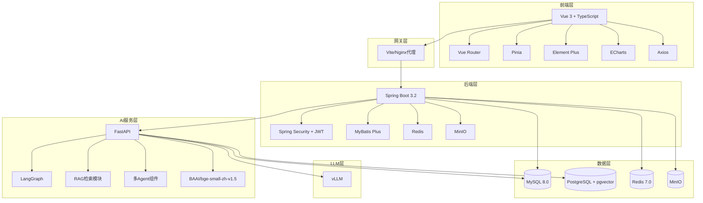
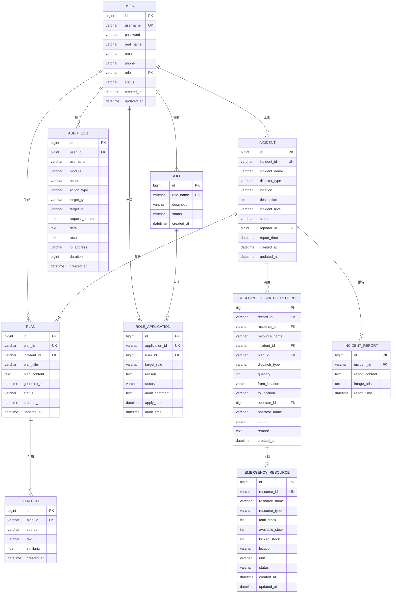
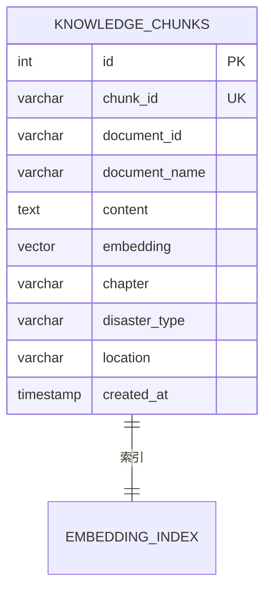
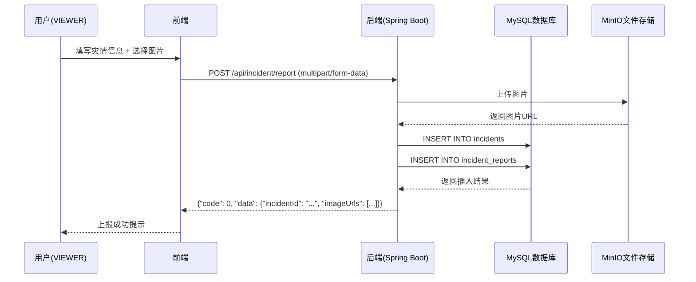
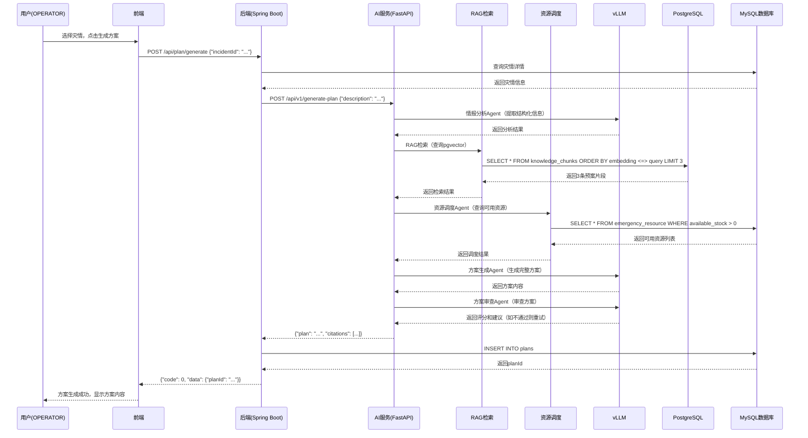
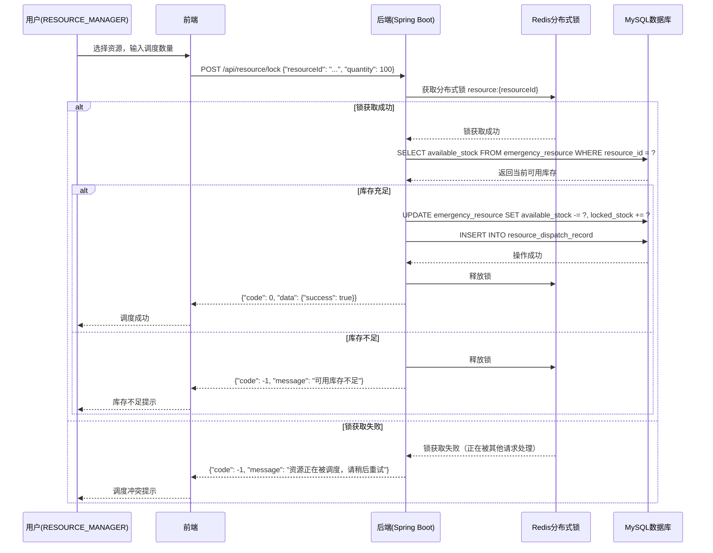
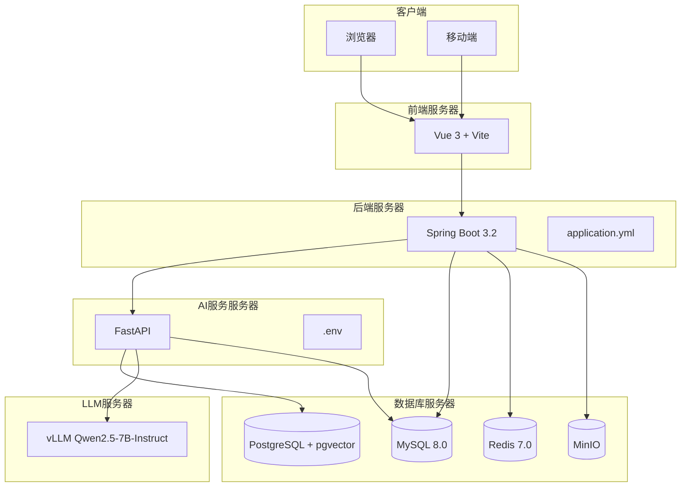
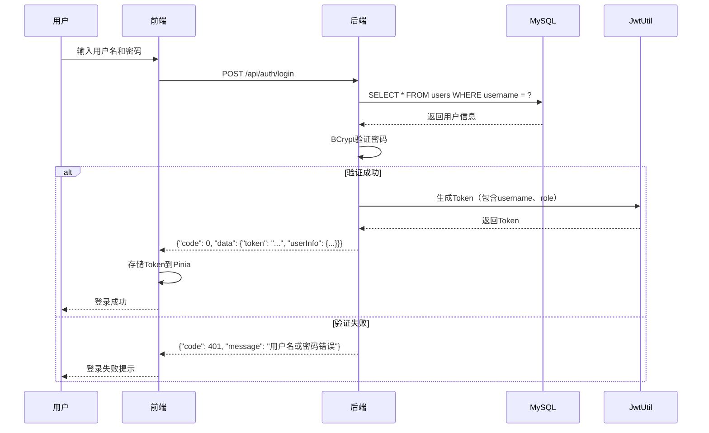

# 云南自然灾害应急协同决策平台 - 系统设计说明书

## 1. 整体架构设计

### 1.1 架构图



### 1.2 架构说明

| 层级 | 技术栈 | 职责 |
|------|--------|------|
| 前端层 | Vue 3 + TypeScript + Element Plus | 用户界面展示、交互逻辑、状态管理 |
| 网关层 | Vite/Nginx | 反向代理、路由转发、跨域处理 |
| 后端层 | Spring Boot 3.2 + Spring Security + JWT | 业务逻辑处理、身份认证、接口管理 |
| AI服务层 | FastAPI + LangGraph + RAG | AI方案生成、多Agent工作流编排、知识库检索 |
| LLM层 | vLLM | 大语言模型推理服务 |
| 数据层 | MySQL + PostgreSQL + Redis + MinIO | 业务数据、向量数据、缓存、文件存储 |

---

## 2. ER图

### 2.1 数据库关系图



### 2.2 向量数据库表（PostgreSQL）



---

## 3. 时序图

### 3.1 灾情上报流程



### 3.2 方案生成流程



### 3.3 资源调度流程



---

## 4. 部署图

### 4.1 服务器部署结构



### 4.2 部署配置

| 服务 | 主机 | 端口 | 协议 | 说明 |
|------|------|------|------|------|
| 前端 | localhost | 3000 | HTTP | Vue开发服务器 |
| 后端 | localhost | 8080 | HTTP | Spring Boot |
| AI服务 | localhost | 8002 | HTTP | FastAPI |
| vLLM | localhost | 8000 | HTTP | OpenAI兼容API |
| MySQL | localhost | 3306 | TCP | 主业务数据库 |
| PostgreSQL | localhost | 5432 | TCP | 向量数据库 |
| Redis | localhost | 6379 | TCP | 缓存和分布式锁 |
| MinIO | localhost | 9000 | HTTP | 文件存储 |

### 4.3 Docker部署（生产环境）

```yaml
# docker-compose.yml
services:
  mysql:
    image: mysql:8.0
    ports:
      - "3306:3306"
    environment:
      MYSQL_ROOT_PASSWORD: password
      MYSQL_DATABASE: emergency_db
  
  postgresql:
    image: ankane/pgvector:latest
    ports:
      - "5432:5432"
    environment:
      POSTGRES_PASSWORD: password
      POSTGRES_DB: emergency_vector
  
  redis:
    image: redis:7.0
    ports:
      - "6379:6379"
  
  minio:
    image: minio/minio
    ports:
      - "9000:9000"
    command: server /data
```

---

## 5. 技术栈说明

### 5.1 前端技术栈

| 技术 | 版本 | 用途 |
|------|------|------|
| Vue | 3.4+ | 前端框架 |
| TypeScript | 5.4+ | 类型安全 |
| Vite | 5.2+ | 构建工具 |
| Element Plus | 2.6+ | UI组件库 |
| Pinia | 2.1+ | 状态管理 |
| Vue Router | 4.3+ | 路由管理 |
| Axios | 1.6+ | HTTP客户端 |
| ECharts | 5.5+ | 图表可视化 |

### 5.2 后端技术栈

| 技术 | 版本 | 用途 |
|------|------|------|
| Java | 21 | 编程语言 |
| Spring Boot | 3.2+ | 后端框架 |
| Spring Security | 6.2+ | 安全框架 |
| JWT | - | 身份认证 |
| MyBatis Plus | 3.5+ | ORM框架 |
| Redis | 7.0+ | 缓存和分布式锁 |
| MinIO | - | 文件存储 |
| Lombok | 1.18+ | 代码简化 |

### 5.3 AI服务技术栈

| 技术 | 版本 | 用途 |
|------|------|------|
| Python | 3.10 | 编程语言 |
| FastAPI | 0.140+ | API框架 |
| LangGraph | 1.2+ | 多Agent工作流编排 |
| Transformers | 5.14+ | 模型库 |
| sentence-transformers | 5.6+ | Embedding模型 |
| psycopg2 | 2.9+ | PostgreSQL驱动 |
| pymysql | 1.2+ | MySQL驱动 |
| aiohttp | 3.14+ | 异步HTTP客户端 |

### 5.4 LLM技术栈

| 技术 | 版本 | 用途 |
|------|------|------|
| vLLM | 0.4+ | LLM推理引擎 |
| Qwen2.5-7B-Instruct | - | 中文大语言模型 |
| BAAI/bge-small-zh-v1.5 | - | 中文Embedding模型 |

### 5.5 数据库技术栈

| 技术 | 版本 | 用途 |
|------|------|------|
| MySQL | 8.0+ | 主业务数据库 |
| PostgreSQL | 15+ | 向量数据库 |
| pgvector | - | PostgreSQL向量扩展 |
| Redis | 7.0+ | 缓存和分布式锁 |
| MinIO | - | 对象存储 |

---

## 6. 模块划分

### 6.1 前端模块

| 模块 | 文件路径 | 职责 |
|------|----------|------|
| 认证模块 | `src/api/login.ts`, `src/stores/auth.ts` | 用户登录、注册、Token管理 |
| 灾情模块 | `src/api/incident.ts`, `src/stores/incident.ts`, `src/views/Incident/` | 灾情上报、列表、详情 |
| 方案模块 | `src/api/plan.ts`, `src/stores/plan.ts`, `src/views/Plan/` | 方案生成、列表、详情 |
| 资源模块 | `src/api/resource.ts`, `src/stores/resource.ts`, `src/views/Resource/` | 资源管理、调度 |
| Dashboard模块 | `src/api/dashboard.ts`, `src/views/Home/`, `src/views/Screen/` | 数据展示、大屏 |
| 系统模块 | `src/api/member.ts`, `src/views/Member/`, `src/views/Knowledge/` | 用户管理、知识库 |
| 工具模块 | `src/utils/request.ts`, `src/utils/token.ts` | 请求封装、Token管理 |

### 6.2 后端模块

| 模块 | 文件路径 | 职责 |
|------|----------|------|
| 认证模块 | `controller/AuthController.java`, `service/AuthService.java` | 登录、注册、JWT认证 |
| 灾情模块 | `controller/IncidentController.java`, `service/IncidentService.java` | 灾情CRUD |
| 方案模块 | `controller/PlanController.java`, `service/PlanService.java` | 方案生成、审核 |
| 资源模块 | `controller/ResourceController.java`, `service/ResourceService.java` | 资源管理、调度 |
| Dashboard模块 | `controller/DashboardController.java`, `service/DashboardService.java` | 统计数据 |
| 系统模块 | `controller/MemberController.java`, `controller/KnowledgeController.java` | 用户、知识库管理 |
| 审计模块 | `controller/AuditLogController.java`, `aspect/AuditLogAspect.java` | 操作日志 |
| 安全模块 | `config/SecurityConfig.java`, `filter/JwtAuthenticationFilter.java` | 权限配置、Token过滤 |

### 6.3 AI服务模块

| 模块 | 文件路径 | 职责 |
|------|----------|------|
| 主入口 | `main.py` | FastAPI服务启动 |
| Agent模块 | `agents/` | 情报分析、方案生成、审查、资源调度 |
| RAG模块 | `rag/retriever.py` | 向量检索 |
| 工具模块 | `utils/logger.py` | 日志管理 |

---

## 7. 安全设计

### 7.1 认证机制



### 7.2 权限控制

| 资源 | VIEWER | OPERATOR | RESOURCE_MANAGER | ADMIN |
|------|:------:|:--------:|:----------------:|:-----:|
| /api/auth/** | ✅公开 | ✅公开 | ✅公开 | ✅公开 |
| /api/dashboard/** | ✅ | ✅ | ✅ | ✅ |
| /api/incident/list/detail | ✅ | ✅ | ✅ | ✅ |
| /api/incident/report | ✅ | ✅ | ✅ | ✅ |
| /api/incident/submit/status | ❌ | ✅ | ✅ | ✅ |
| /api/plan/list/detail/stream | ✅ | ✅ | ✅ | ✅ |
| /api/plan/generate | ❌ | ✅ | ❌ | ✅ |
| /api/disposal-plan/** | ❌ | ✅ | ❌ | ✅ |
| /api/resource/** | ❌ | ❌ | ✅ | ✅ |
| /api/resource-request/** | ❌ | ❌ | ✅ | ✅ |
| /api/dispatch/** | ❌ | ❌ | ✅ | ✅ |
| /api/resource-shortage/** | ❌ | ❌ | ✅ | ✅ |
| /api/role-application/** | ✅ | ✅ | ✅ | ✅ |
| /api/user/** | ❌ | ❌ | ❌ | ✅ |
| /api/knowledge/** | ❌ | ❌ | ❌ | ✅ |
| /api/agent/** | ❌ | ❌ | ❌ | ✅ |
| /api/audit/** | ❌ | ❌ | ❌ | ✅ |

### 7.3 CORS配置

```java
// SecurityConfig.java
@Bean
public CorsFilter corsFilter() {
    CorsConfiguration config = new CorsConfiguration();
    config.setAllowCredentials(true);
    config.addAllowedOriginPattern("*");
    config.addAllowedHeader("*");
    config.addAllowedMethod("*");
    UrlBasedCorsConfigurationSource source = new UrlBasedCorsConfigurationSource();
    source.registerCorsConfiguration("/**", config);
    return new CorsFilter(source);
}
```

---

## 8. 文档版本记录

| 版本 | 日期 | 修改人 | 修改内容 |
|------|------|--------|----------|
| V1.0 | 2026-07-25 | 系统生成 | 初始版本 |
