# 云南自然灾害应急协同决策平台 - 需求规格说明书

## 1. 项目背景和目标

### 1.1 项目背景
云南省地处中国西南边陲，地理环境复杂，自然灾害频发，包括地震、洪涝、泥石流、森林火灾等多种灾害类型。为了提高应急响应效率，实现灾害信息快速上报、智能方案生成和资源高效调度，需要建设一套基于多智能体的应急协同决策平台。

### 1.2 项目目标
- **灾情快速上报**：支持图文混合上报，实现灾情信息的快速录入和分发
- **智能方案生成**：基于大语言模型和应急预案知识库，自动生成应急处置方案
- **资源高效调度**：实现应急资源的统一管理和智能调度
- **决策可视化**：通过数据大屏展示灾害态势、资源分布和处置进度
- **多角色协同**：支持多角色协同，提高应急响应效率
- **地理编码服务**：灾情上报时根据地址自动获取经纬度，支持地图可视化
- **地图态势展示**：在地图上展示灾情点位，支持聚合和筛选
- **历史数据坐标补全**：提供批量补全接口，为历史灾情数据补充经纬度

---

## 2. 用户角色定义

| 角色代码 | 角色名称 | 职责描述 |
|----------|----------|----------|
| VIEWER | 普通信息员 | 灾情上报、查看灾情列表和详情、查看方案、申请角色升级 |
| OPERATOR | 应急指挥人员 | 生成应急方案、提交和审核处置方案、灾情状态流转 |
| RESOURCE_MANAGER | 资源管理员 | 资源管理、资源调度、资源申请处理、调度指令管理 |
| ADMIN | 系统管理员 | 系统配置、用户管理、知识库管理、审计日志查看、角色申请审核 |

---

## 3. 用户故事

### 3.1 VIEWER（普通信息员）

**故事1：灾情上报**
> 作为一名普通信息员，我希望能够快速上报灾情信息，包括文字描述和现场图片，以便指挥中心及时了解灾情。

**故事2：查看灾情**
> 作为一名普通信息员，我希望能够查看系统中的灾情列表和详细信息，了解灾害处置进度。

**故事3：角色升级申请**
> 作为一名普通信息员，我希望能够申请升级为应急指挥人员或资源管理员，以便承担更多职责。

**故事4：查看灾情地图**
> 作为一名普通信息员，我希望能够在地图上查看灾情分布，以便直观了解灾害位置和影响范围。

### 3.2 OPERATOR（应急指挥人员）

**故事1：生成应急方案**
> 作为应急指挥人员，我希望系统能够根据灾情信息自动生成应急处置方案，提高决策效率。

**故事2：审核处置方案**
> 作为应急指挥人员，我希望能够审核和提交处置方案，确保方案的科学性和可行性。

**故事3：灾情状态管理**
> 作为应急指挥人员，我希望能够更新灾情状态，跟踪灾害处置进度。

**故事4：地图态势分析**
> 作为应急指挥人员，我希望能够在地图上查看所有灾情点位，按灾害类型和状态筛选，以便快速掌握全局态势。

### 3.3 RESOURCE_MANAGER（资源管理员）

**故事1：资源调度**
> 作为资源管理员，我希望能够根据灾情需求调度应急资源，确保资源及时到位。

**故事2：资源申请处理**
> 作为资源管理员，我希望能够处理资源申请请求，合理分配资源。

**故事3：调度指令管理**
> 作为资源管理员，我希望能够发布调度指令，跟踪指令执行情况。

### 3.4 ADMIN（系统管理员）

**故事1：用户管理**
> 作为系统管理员，我希望能够管理系统用户，包括创建、修改和禁用用户账号。

**故事2：知识库管理**
> 作为系统管理员，我希望能够管理应急预案知识库，上传和更新预案文档。

**故事3：审计日志**
> 作为系统管理员，我希望能够查看系统操作日志，进行安全审计和操作追溯。

**故事4：历史数据坐标补全**
> 作为系统管理员，我希望能够批量补全历史灾情数据的经纬度信息，以便在地图上展示。

---

## 4. 用例图

```mermaid
graph TD
    subgraph 用户角色
        VIEWER[普通信息员]
        OPERATOR[应急指挥人员]
        RESOURCE_MANAGER[资源管理员]
        ADMIN[系统管理员]
    end
    
    subgraph 认证模块
        UC1[用户登录]
        UC2[用户注册]
        UC3[角色申请]
        UC4[角色审核]
    end
    
    subgraph 灾情管理模块
        UC5[灾情上报]
        UC6[灾情列表]
        UC7[灾情详情]
        UC8[状态流转]
        UC9[地理编码]
    end
    
    subgraph 方案管理模块
        UC10[方案生成]
        UC11[方案列表]
        UC12[方案详情]
        UC13[方案审核]
        UC14[方案流式输出]
    end
    
    subgraph 资源管理模块
        UC15[资源列表]
        UC16[资源调度]
        UC17[资源申请]
        UC18[调度指令]
    end
    
    subgraph 系统管理模块
        UC19[用户管理]
        UC20[知识库管理]
        UC21[审计日志]
        UC22[Agent审计]
    end
    
    subgraph Dashboard模块
        UC23[概览]
        UC24[趋势分析]
        UC25[分布统计]
        UC26[数据大屏]
        UC27[地图态势展示]
    end
    
    VIEWER --> UC1
    VIEWER --> UC2
    VIEWER --> UC3
    VIEWER --> UC5
    VIEWER --> UC6
    VIEWER --> UC7
    VIEWER --> UC9
    VIEWER --> UC11
    VIEWER --> UC12
    VIEWER --> UC23
    VIEWER --> UC24
    VIEWER --> UC25
    VIEWER --> UC26
    VIEWER --> UC27
    
    OPERATOR --> UC1
    OPERATOR --> UC6
    OPERATOR --> UC7
    OPERATOR --> UC8
    OPERATOR --> UC9
    OPERATOR --> UC10
    OPERATOR --> UC11
    OPERATOR --> UC12
    OPERATOR --> UC13
    OPERATOR --> UC14
    OPERATOR --> UC23
    OPERATOR --> UC24
    OPERATOR --> UC25
    OPERATOR --> UC26
    OPERATOR --> UC27
    
    RESOURCE_MANAGER --> UC1
    RESOURCE_MANAGER --> UC15
    RESOURCE_MANAGER --> UC16
    RESOURCE_MANAGER --> UC17
    RESOURCE_MANAGER --> UC18
    RESOURCE_MANAGER --> UC23
    RESOURCE_MANAGER --> UC24
    RESOURCE_MANAGER --> UC25
    RESOURCE_MANAGER --> UC26
    RESOURCE_MANAGER --> UC27
    
    ADMIN --> UC1
    ADMIN --> UC2
    ADMIN --> UC4
    ADMIN --> UC19
    ADMIN --> UC20
    ADMIN --> UC21
    ADMIN --> UC22
    ADMIN --> UC23
    ADMIN --> UC24
    ADMIN --> UC25
    ADMIN --> UC26
    ADMIN --> UC27
```

---

## 5. 功能需求列表

### 5.1 认证模块

| 需求编号 | 功能点 | 描述 | 涉及角色 |
|----------|--------|------|----------|
| REQ-AUTH-001 | 用户登录 | 用户通过用户名和密码登录系统，获取JWT Token | 所有角色 |
| REQ-AUTH-002 | 用户注册 | 用户注册账号，系统自动分配VIEWER角色 | 新用户 |
| REQ-AUTH-003 | 角色申请 | VIEWER用户可以申请升级为OPERATOR或RESOURCE_MANAGER | VIEWER |
| REQ-AUTH-004 | 角色审核 | ADMIN审核角色申请，批准或驳回 | ADMIN |

### 5.2 灾情管理模块

| 需求编号 | 功能点 | 描述 | 涉及角色 |
|----------|--------|------|----------|
| REQ-INCIDENT-001 | 灾情上报 | 上报灾情信息，支持图文混合上传 | VIEWER |
| REQ-INCIDENT-002 | 自动地理编码 | 上报时根据地址自动调用高德API获取经纬度，支持本地缓存和降级匹配 | VIEWER, OPERATOR |
| REQ-INCIDENT-003 | 灾情列表 | 分页查看灾情列表，支持多条件筛选 | 所有角色 |
| REQ-INCIDENT-004 | 灾情详情 | 查看灾情详细信息，包括图片和处理记录 | 所有角色 |
| REQ-INCIDENT-005 | 状态流转 | 更新灾情状态（待确认→已确认→处置中→已结束） | OPERATOR, ADMIN |
| REQ-INCIDENT-006 | 历史数据坐标补全 | 批量为历史灾情数据补充经纬度信息 | ADMIN |

### 5.3 方案管理模块

| 需求编号 | 功能点 | 描述 | 涉及角色 |
|----------|--------|------|----------|
| REQ-PLAN-001 | 方案生成 | 根据灾情信息调用AI服务生成应急处置方案 | OPERATOR, ADMIN |
| REQ-PLAN-002 | 方案列表 | 查看灾情相关的方案列表 | 所有角色 |
| REQ-PLAN-003 | 方案详情 | 查看方案详细内容 | 所有角色 |
| REQ-PLAN-004 | 方案审核 | 人工审核AI生成的方案，支持通过、驳回、修改 | OPERATOR, ADMIN |
| REQ-PLAN-005 | 方案流式输出 | 通过SSE流式推送方案内容，实现打字机效果 | OPERATOR, ADMIN |

### 5.4 资源管理模块

| 需求编号 | 功能点 | 描述 | 涉及角色 |
|----------|--------|------|----------|
| REQ-RESOURCE-001 | 资源列表 | 查看应急资源列表，支持按类型筛选 | RESOURCE_MANAGER, ADMIN |
| REQ-RESOURCE-002 | 资源调度 | 锁定和释放资源，使用Redis分布式锁防止并发冲突 | RESOURCE_MANAGER, ADMIN |
| REQ-RESOURCE-003 | 资源申请 | 提交资源申请请求 | OPERATOR, VIEWER |
| REQ-RESOURCE-004 | 调度指令 | 发布和管理资源调度指令 | RESOURCE_MANAGER, ADMIN |
| REQ-RESOURCE-005 | 资源不足警告 | 处理资源不足警告信息 | RESOURCE_MANAGER, ADMIN |

### 5.5 系统管理模块

| 需求编号 | 功能点 | 描述 | 涉及角色 |
|----------|--------|------|----------|
| REQ-SYS-001 | 用户管理 | 管理系统用户，包括创建、修改、禁用 | ADMIN |
| REQ-SYS-002 | 知识库管理 | 上传、查看、删除应急预案文档 | ADMIN |
| REQ-SYS-003 | 审计日志 | 查看系统操作日志，支持按用户、模块、时间筛选 | ADMIN |
| REQ-SYS-004 | Agent审计 | 查看AI Agent执行记录和详情 | ADMIN |

### 5.6 Dashboard模块

| 需求编号 | 功能点 | 描述 | 涉及角色 |
|----------|--------|------|----------|
| REQ-DASHBOARD-001 | 概览 | 展示今日灾情数、活跃灾情数、待处理数等统计数据 | 所有角色 |
| REQ-DASHBOARD-002 | 趋势分析 | 展示灾情数量的时间趋势图 | 所有角色 |
| REQ-DASHBOARD-003 | 分布统计 | 展示灾情类型和地区分布 | 所有角色 |
| REQ-DASHBOARD-004 | 数据大屏 | 展示全局数据大屏，用于指挥中心展示 | 所有角色 |
| REQ-DASHBOARD-005 | 地图态势展示 | 在地图上展示灾情点位，支持聚合显示和按灾害类型、状态筛选 | 所有角色 |

---

## 6. 非功能需求

### 6.1 性能需求

| 需求编号 | 描述 |
|----------|------|
| NFR-PERF-001 | 登录接口响应时间 ≤ 500ms |
| NFR-PERF-002 | 灾情列表查询响应时间 ≤ 150ms |
| NFR-PERF-003 | 方案生成接口响应时间 ≤ 120s（含AI推理） |
| NFR-PERF-004 | 系统支持至少100个并发用户 |
| NFR-PERF-005 | 资源调度操作使用Redis分布式锁，确保并发安全 |

#### AI服务性能指标

| 指标 | 参考值 | 说明 |
|------|--------|------|
| 情报分析耗时 | 1-3秒 | 从灾情描述提取结构化信息 |
| RAG检索耗时 | 2-5秒 | 含Embedding生成（首次加载模型约10秒） |
| 资源调度耗时 | <1秒 | MySQL数据库查询 |
| 方案生成耗时 | 5-15秒 | 取决于方案长度和LLM推理速度 |
| 方案审查耗时 | 1-3秒 | 规则检查 + LLM深度审查 |
| 端到端工作流耗时 | 15-30秒 | 不含重试的单次流程时间 |
| PDF向量化耗时 | 30-60秒/文档 | 13个切片参考值 |
| Embedding生成耗时 | ~0.5秒/条 | CPU推理模式 |

### 6.2 安全需求

| 需求编号 | 描述 |
|----------|------|
| NFR-SEC-001 | 使用JWT Token进行身份认证，Token有效期24小时 |
| NFR-SEC-002 | 密码使用BCrypt加密存储 |
| NFR-SEC-003 | 所有接口需要认证（除登录和注册） |
| NFR-SEC-004 | 基于角色的访问控制（RBAC） |
| NFR-SEC-005 | 记录所有操作日志，支持审计追溯 |
| NFR-SEC-006 | 配置CORS，限制允许的跨域来源 |

### 6.3 可用性需求

| 需求编号 | 描述 |
|----------|------|
| NFR-AVAIL-001 | 系统可用性 ≥ 99.5% |
| NFR-AVAIL-002 | 支持数据库备份和恢复 |
| NFR-AVAIL-003 | AI服务降级策略：vLLM不可用时使用Mock数据 |
| NFR-AVAIL-004 | RAG检索降级策略：数据库连接失败时返回空列表 |
| NFR-AVAIL-005 | 地理编码降级策略：高德API不可用时使用本地城市坐标缓存和模糊匹配 |
| NFR-AVAIL-006 | 坐标数据精度：经纬度字段使用DECIMAL(10,7)存储（精度约1厘米），Java实体使用BigDecimal类型确保映射精度不丢失 |

#### AI服务降级策略

| 模块 | 降级策略 | 说明 |
|------|----------|------|
| 情报分析Agent | vLLM不可用时返回默认情报（类型=其他，等级=中） | 不中断工作流 |
| RAG检索Agent | 数据库连接失败时返回空列表 | 不中断工作流 |
| 资源调度Agent | MySQL不可用时使用内置资源模板生成推荐 | 根据灾害等级调整资源数量 |
| 方案生成Agent | vLLM不可用时使用模板化默认方案 | 包含资源调度建议和参考资料章节 |
| 方案审查Agent | vLLM不可用时若章节完整则直接通过 | 规则检查优先 |
| 审计日志提交 | 提交失败仅记录日志，不影响主流程 | 异步提交 |
| 向量化流水线 | 单条Embedding失败跳过，整体失败返回失败状态 | 记录失败原因 |

### 6.4 可扩展性需求

| 需求编号 | 描述 |
|----------|------|
| NFR-EXT-001 | 采用微服务架构，支持独立部署和扩展 |
| NFR-EXT-002 | 支持添加新的灾害类型和应急资源类型 |
| NFR-EXT-003 | 支持添加新的AI Agent组件 |
| NFR-EXT-004 | 支持配置不同的Embedding模型和LLM模型 |

### 6.5 兼容性需求

| 需求编号 | 描述 |
|----------|------|
| NFR-COMP-001 | 前端支持Chrome、Firefox、Edge主流浏览器 |
| NFR-COMP-002 | 移动端自适应布局 |
| NFR-COMP-003 | 支持vLLM和其他OpenAI兼容的LLM服务 |

---

## 7. 数据需求

### 7.1 核心数据实体

| 实体 | 描述 | 存储位置 |
|------|------|----------|
| 用户（User） | 系统用户信息 | MySQL |
| 角色（Role） | 用户角色定义 | MySQL |
| 灾情（Incident） | 灾情事件信息（含latitude/longitude经纬度字段，DECIMAL(10,7)精度，Java实体使用BigDecimal类型映射） | MySQL |
| 方案（Plan） | AI生成的应急方案 | MySQL |
| 资源（EmergencyResource） | 应急资源信息 | MySQL |
| 调度记录（ResourceDispatchRecord） | 资源调度操作记录 | MySQL |
| 知识库片段（KnowledgeChunks） | 应急预案向量数据 | PostgreSQL + pgvector |
| 审计日志（AuditLog） | 系统操作日志 | MySQL |
| Agent执行记录（AgentRun） | AI Agent执行记录 | MySQL |
| 地理位置（Location） | 地理位置信息（PostgreSQL） | PostgreSQL

### 7.2 数据量估算

| 数据类型 | 初始数据量 | 年增长预估 |
|----------|------------|------------|
| 用户 | 20条 | 100条/年 |
| 灾情 | 50条 | 500条/年 |
| 方案 | 50条 | 500条/年 |
| 资源 | 100条 | 200条/年 |
| 知识库片段 | 201条 | 500条/年 |
| 审计日志 | 随操作增长 | 约10000条/年 |

---

## 8. 接口需求

### 8.1 前端接口需求

| 需求编号 | 描述 |
|----------|------|
| NFR-API-001 | 所有接口采用RESTful风格 |
| NFR-API-002 | 响应格式统一：`{ code, message, data, timestamp }` |
| NFR-API-003 | 认证方式：`Authorization: Bearer <token>` |
| NFR-API-004 | 支持SSE流式接口用于方案生成 |
| NFR-API-005 | 支持multipart/form-data用于图片上传 |

### 8.2 AI服务接口需求

| 需求编号 | 描述 |
|----------|------|
| NFR-AI-001 | 提供同步和异步两种方案生成接口 |
| NFR-AI-002 | 响应中包含citations字段，记录参考来源 |
| NFR-AI-003 | 支持RAG检索，从知识库获取相关预案 |
| NFR-AI-004 | 支持资源调度，从MySQL查询可用资源 |

---

## 9. 部署需求

### 9.1 硬件需求

| 服务 | CPU | 内存 | 存储 | 网络 |
|------|-----|------|------|------|
| 前端 | 2核 | 4GB | 10GB | 100Mbps |
| 后端 | 4核 | 8GB | 50GB | 100Mbps |
| AI服务 | 8核 | 16GB | 100GB | 100Mbps |
| vLLM | 8核 | 32GB+GPU | 200GB | 100Mbps |
| 数据库 | 4核 | 16GB | 200GB | 100Mbps |

### 9.2 软件需求

| 软件 | 版本 | 用途 |
|------|------|------|
| Java | 21 | 后端运行环境 |
| Python | 3.10 | AI服务运行环境 |
| MySQL | 8.0+ | 主业务数据库 |
| PostgreSQL | 15+ | 向量数据库（含pgvector扩展） |
| Redis | 7.0+ | 缓存和分布式锁 |
| vLLM | 0.4+ | LLM推理服务 |

---

## 10. 文档版本记录

| 版本 | 日期 | 修改人 | 修改内容 |
|------|------|--------|----------|
| V1.0 | 2026-07-25 | 系统生成 | 初始版本 |
| V2.0 | 2026-07-26 | 系统生成 | 项目目标增加地理编码和地图展示，用户故事增加地图相关故事，用例图增加地理编码和地图态势展示用例，功能需求增加地理编码和坐标补全需求，可用性需求增加地理编码降级策略，核心数据实体增加Location实体 |
| V3.0 | 2026-07-27 | 系统生成 | 核心数据实体补充经纬度精度说明和BigDecimal映射，新增NFR-AVAIL-006坐标数据精度需求 |
| V4.0 | 2026-07-28 | 系统生成 | 整合AI服务说明文档内容：补充AI服务性能指标（情报分析、RAG检索、资源调度、方案生成、方案审查耗时），补充AI服务降级策略（各Agent模块的降级方案） |
